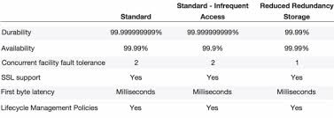
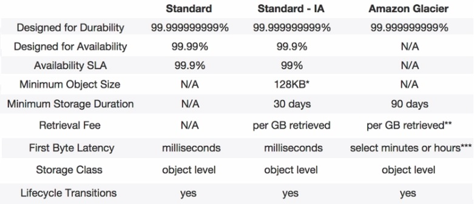
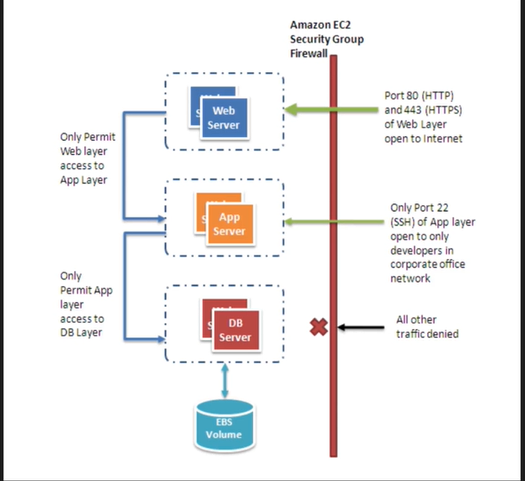

# AWS CSA 2018 Study Guide

#### The purpose of this guide is to share my notes taken while studying for the AWS CSA re-certification exam. I use the awesome ACloud.guru course & other material listed below which I feel will help certification aspirants for purpose of self-study and quick revision. The course content copyrights are owned by [ACloud Guru Ltd.](https://acloud.guru)

#### You can also read this on [Gitbooks](https://agasthik.gitbooks.io/aws-csa/content/) or [Medium](https://medium.com/@agasthi.kothurkar/aws-csa-2017-study-guide-90fa9ee7c9d0) and download the guide in PDF format [here](https://www.gitbook.com/download/pdf/book/agasthik/aws-csa)

################# IMPORTANT NOTE #################
### I(Akhilesh Saini) prepared these notes while studying for my certification exam in Apr 2018.

### This is the original work of mentioned repo. [Github Repo](https://github.com/agasthik/aws-csa-2017/)

#### Note : Bulletted points with * prepended are bit trickier to understand. So pay special attention to those.

Table of Contents                                                                                                                       
=================                                                           
   * [Exam Blueprint](#exam-blueprint)                                                                                               
   * [Course Video Durations](#course-video-durations)                                                                               
   * [AWS 10000 Feet Overview](#aws-10000-feet-overview)                                                                               
      * [Global Infrastructure](#global-infrastructure)                                                                                 
      * [The AWS Platform](#the-aws-platform)                                                                                           
   * [Identity &amp; Access Management](#identity--access-management)                                                                   
      * [IAM 101](#iam-101)                                                                                                             
         * [Critical Terms](#critical-terms)                                                                                           
         * [IAM Features](#iam-features)                                                                                               
   * [AWS Object Storage &amp; CDN – S3, Glacier and CloudFront](#aws-object-storage--cdn--s3-glacier-and-cloudfront)                   
      * [S3 101](#s3-101)                                                                                                               
         * [S3 Object Storage Classes](#s3-object-storage-classes)                                                                     
         * [S3 Buckets](#s3-buckets)                                                                                                   
         * [S3 Versioning](#s3-versioning)                                                                                             
      * [Cross Region Replication](#cross-region-replication)                                                                           
      * [Lifecycle Management](#lifecycle-management)                                                                                   
      * [CloudFront CDN Overview](#cloudfront-cdn-overview)                                                                             
         * [Important terms](#important-terms)                                                                                         
         * [CloudFront Security.](#cloudfront-security)                                                                                 
      * [S3 Security &amp; Encryption](#s3-security--encryption)                                                                       
         * [Security](#security)                                                                                                       
         * [Encryption](#encryption)                                                                                                   
      * [Storage Gateway](#storage-gateway)                                                                                             
      * [Snowball](#snowball)                                                                                                           
         * [Snowball Standard](#snowball-standard)                                                                                     
         * [Snowball Edge](#snowball-edge)                                                                                             
         * [Snowmobile](#snowmobile)                                                                                                   
      * [S3 Transfer Acceleration](#s3-transfer-acceleration)                                                                           
   * [EC2 – The Backbone of AWS](#ec2--the-backbone-of-aws)                                                                             
      * [EC2 101](#ec2-101)                                                                                                             
         * [EC2 Pricing](#ec2-pricing)                                                                                                 
         * [EC2 Instance Types](#ec2-instance-types)                                                                                   
      * [EBS](#ebs)                                                                                                                     
      * [EC2 Security Groups](#ec2-security-groups)                                                                                     
      * [Volumes and Snapshots](#volumes-and-snapshots)                                                                                 
         * [RAID, Volumes &amp; Snapshots.](#raid-volumes--snapshots)                                                                   
      * [EBS backed v/s Instance store](#ebs-backed-vs-instance-store)
      * [ELB(Elastic Load Balancer)](#elbelastic-load-balancer)
      * [EC2 Status Checks](#ec2-status-checks)
         * [System Status Checks](#system-status-checks)
      * [Instance Status Checks](#instance-status-checks)
      * [CloudWatch](#cloudwatch)                                                                               
      * [AWS CLI Usage](#aws-cli-usage)
      * [IAM Roles for EC2](#iam-roles-for-ec2)
      * [Bootstrap scripts.](#bootstrap-scripts)
      * [EC2 Instance Meta-Data](#ec2-instance-meta-data)
      * [Launch Configurations & Auto Scaling Groups 101](#launch-configurations--auto-scaling-groups-101)               
      * [EC2 Placement groups](#ec2-placement-groups)
      * [EFS(Elastic File System)](#efselastic-file-system)
      * [AWS Lambda](#aws-lambda)
   * [Route 53](#route-53)                 
      * [DNS 101](#dns-101)
         * [Types of DNS Records -](#types-of-dns-records--)
         * [Hosted Zone](#hosted-zone)
      * [Route53 Routing Policies](#route53-routing-policies)
      * [DNS Exam Tips](#dns-exam-tips)
   * [Databases on AWS](#databases-on-aws)
      * [Databases 101](#databases-101)
         * [RDBMS](#rdbms)   
         * [NoSQL DBs](#nosql-dbs)
         * [Data Warehousing](#data-warehousing)
         * [ElastiCache](#elasticache)
         * [Database Migration Service](#database-migration-service)              
      * [RDS – Back Ups, Multi AZs &amp; Read Replicas](#rds--back-ups-multi-azs--read-replicas)
         * [Backups](#backups)
         * [Snapshots](#snapshots)
         * [Encryption](#encryption-1)
         * [Multi-AZ Deployment](#multi-az-deployment)                                                                                 
         * [Read Replica Databases.](#read-replica-databases)                                                                           
      * [DynamoDB](#dynamodb)                                                                                                           
         * [RDS v/s DynamoDB](#rds-vs-dynamodb)                                                                                         
      * [Redshift](#redshift)                                                                                                           
         * [Configurations](#configurations)                                                                                           
         * [Performance](#performance)                                                                                                 
         * [Pricing](#pricing)                                                                                                         
         * [Security](#security-1)                                                                                                     
         * [Availability](#availability)                                                                                               
      * [ElastiCache](#elasticache-1)                                                                                                   
         * [Memcached](#memcached)                                                                                                     
         * [Redis](#redis)                                                                                                             
      * [Aurora](#aurora)                                                                                                               
         * [Performance](#performance-1)                                                                                               
         * [Scaling](#scaling)                                                                                                         
         * [Fault Tolerance](#fault-tolerance)                                                                                         
         * [Replicas](#replicas)                                                                                                       
      * [Exam Tips](#exam-tips)                                                                                                         
   * [VPC](#vpc)                                                                                                                       
      * [Introduction](#introduction)                                                                                                   
      * [Default v/s Custom VPC](#default-vs-custom-vpc)                                                                               
      * [Custom VPC Info](#custom-vpc-info)                                                                                             
      * [NAT Instance &amp; NAT Gateway](#nat-instance--nat-gateway)                                                                   
      * [Network ACLs &amp; Security Groups](#network-acls--security-groups)                                                           
      * [Custom VPC &amp; ELB](#custom-vpc--elb)                                                                                       
      * [NAT &amp; Bastion](#nat--bastion)                                                                                             
      * [VPC Flow Logs](#vpc-flow-logs)                                                                                                 
   * [Application Services](#application-services)                                                                                     
      * [SQS – Simple Queue Service](#sqs--simple-queue-service)                                                                       
      * [SWS – Simple Workflow Service](#sws--simple-workflow-service)                                                                 
      * [SNS – Simple Notification Service](#sns--simple-notification-service)                                                         
      * [Elastic Transcoder](#elastic-transcoder)                                                                                       
      * [API Gateway](#api-gateway)                                                                                                     
      * [Amazon Kinesis](#amazon-kinesis)                                                                                               
   * [The Real World – Creating a Fault Tolerant Word Press Site](#the-real-world--creating-a-fault-tolerant-word-press-site)           
   * [Preparing for Exam – While Paper Reviews](#preparing-for-exam--while-paper-reviews)                                               
      * [Overview of Amazon Web Services](#overview-of-amazon-web-services)                                                             
      * [Overview of Security Processes](#overview-of-security-processes)                                                               
      * [Risk and Compliance Whitepaper](#risk-and-compliance-whitepaper)                                                               
      * [Storage Options in the Cloud](#storage-options-in-the-cloud)                                                                   
      * [Architecting for AWS Cloud - Best Practices](#architecting-for-aws-cloud---best-practices)                                     
      * [Exam Practicalities](#exam-practicalities)                                                                                     
   * [Well Architected Framework](#well-architected-framework) 
      * [Design Principles](#design-principles)                                                                                       
      * [Security Areas](#security-areas)                                                                                             
      * [Best Practices](#best-practices)                                                                                             
      * [Design Principles](#design-principles-1)                                                                                    
      * [Areas of Reliability](#areas-of-reliability)                                                                              
      * [Best Practices](#best-practices-1)       
      * [Key AWS Resources](#key-aws-resources)
      * [Design Principles](#design-principles-2)
      * [Areas of Performance Efficiency](#areas-of-performance-efficiency)                                                          
      * [Best Practices](#best-practices-2)
      * [Key AWS Resources](#key-aws-resources-1)                                                                                    
      * [Design Principles](#design-principles-3)                                                                                     \
      * [Areas for Cost Optimization](#areas-for-cost-optimization)                                                                   
      * [Best Practices](#best-practices-3)                                                                                           
      * [Key AWS Services](#key-aws-services)                                                                                        
   * [Additional Exam Tips](#additional-exam-tips)                                                                                     
      * [AWS Exam Tips](#aws-exam-tips)                                                                                                 
      * [Consolidated billing](#consolidated-billing)                                                                                   
      * [Cross Account Access.](#cross-account-access)                                                                                 
      * [Resource Groups / Tagging](#resource-groups--tagging)                                                                         
      * [VPC Peering](#vpc-peering)                                                                                                     
      * [Direct Connect](#direct-connect)                                                                                               
      * [Active Directory Integration](#active-directory-integration)                                                                   
      * [Workspaces.](#workspaces)                                                                                                     
   * [AWS Free Tier Usage](#aws-free-tier-usage)                                                                                       
      * [Free Services Options –](#free-services-options-)                                                                             
      * [Hourly Usage in the Free Tier](#hourly-usage-in-the-free-tier)                                                                 
      * [Free Tier Eligible Amazon Machine Images](#free-tier-eligible-amazon-machine-images)                                           
   * [FAQs of Services](#faqs-of-services)                                                                                             
      * [RDS](#rds)                                                                                                                     
      * [EC2](#ec2)                                                                                                                     
      * [S3](#s3)                                                                                                                       
      * [VPC](#vpc-1)                                                                                                                   
      * [SQS](#sqs)                                                                                                                     
      * [Route 53](#route-53-1)                                                                                                         
      * [SWF](#swf)                                                                                                                     
      * [Classic Load Balancer](#classic-load-balancer)                                                                                 
   * [Quiz Questions – Tricky ones.](#quiz-questions--tricky-ones)                                                                     
   * [Review These Links](#review-these-links) 
   * [Technical Concepts](#technical-concepts)                                                                                                                                                                                                                     

## Exam Blueprint

Review Exam [Blueprint](https://d1.awsstatic.com/training-and-certification/docs-sa-assoc/AWS_Certified_Solutions_Architect_Associate_Feb_2018_%20Exam_Guide_v1.5.2.pdf) –

Choose certification [type] (https://aws.amazon.com/certification/certified-solutions-architect-associate/) -

Scheduling the [exam] (https://www.certmetrics.com/amazon/) using amazon's credentials.

Two levels of the exam for the solution architect one is Certified Soulution Architect-Professional and other is Certified Soulution Architect-Associate. To sit for the professional one you need to have the associate as a prerequisite.

Exam certification levels from easy to hard

Certified Cloud Practioner -> Developer Associate -> Solution Architect Associate -> Sysops Administrator Associate -> Security Speciality -> Big Data Speciality -> Advanced Networking Speciality -> Devops Pro -> Solution Architect Professional

The table below lists the domains measured by this examination and the extent to which they are represented

|Domain | % of Examination|
|------------- |:-------------:|
|1.0 Designing resilient architecture |34% |
|2.0 Define performant architecture |24%|
|3.0 Specify secure application and architecture |26%|
|4.0 Design cost optimized architecture |10% |
|5.0 Define operationaly excellent architecture | 06% |
|**Total**|100%|

The exam is approximately 65 questions in 130 minutes. Pass marks not advertised but generally > 70%

## Course Video Durations

### Can help you plan your study based on your time availability.

|Module|# Lectures|Duration|
|------------- |:-------------:| -----:|
|Introduction To The Course | 3 |29:38|
|AWS - 10,000 Feet Overview|6 |01:19:13|
|Identity Access Management (IAM) | 4 |33:59|
|AWS Object Storage and CDN - S3, Glacier and CloudFront |14  |02:47:10|
|EC2 - The Backbone of AWS|21 | 04:35:38|
|Route53 | 9 |01:06:33|
|Databases on AWS | 8 | 01:30:45|
|VPC| 10 | 01:40:37|
|Application Services | 6 |43:54|
|Kinesis | 2 |15:19|
|The Real World - Creating a fault tolerant Word Press Site | 6 | 01:14:55|
|Preparing for the Exam - White Paper Reviews |7 |54:36|
|The Well Architected Framework |6 | 01:18:32|
|Additional Exam Tips |9 | 53:39|

# AWS 10000 Feet Overview
###### [Go to Index](#table-of-contents)

## Amazon History

  - 2003 - Chris Pinkman and Benjamin Black presented a paper on what Amazon's internal infrastructure      should look like and suggested sellingit as a service
  - 2004 - SQS the first AWS service launched
  - 2006 - Official AWS Launch
  - 2007 - 180K devs on platform
  - 2010 - Amazon.com moved to AWS PlatformRegion is geographical area which consists of at least 2 AZ's
  - 2012 - First Re-Invent conference in Las Vegas
  - 2013 - Certifications Launched
  - 2014 - AWS commited to achieve 100% renewable energy usage for its global footprint
  - 2015 - AWS broke out it's revenue, 6 Billion USD per annum and growing close to 90% year after year

## Global Infrastructure

  - A Region is geographical area consisting of 2 or more availability zones.
  - Availability zone is logical data center.
  - A AZ can be different for different accounts while having the same name. i.e. us-east-1a can be physically different for different accounts. Randomization of AZs per account basis due to very likely picking up the first option in dropdown.
  - Edge Locations are CDN End Points for CloudFront. Many more edge locations exist than regions.
  - 18 Geographical regions and 54 availability zones.
  - 1 Local region.
  - Anounced plan for 4 Geographical regions and 12 availability zones.
  - An AWS local region is a single datacenter designed to complement an existing AWS region.

## Tags

  - Key/Value pairs attached to AWS resources
  - Metadata (data about data)
  - Sometimes can be inherited (Auto-scaling, CloudFormation, Elastic Beanstalk can create other resources)
  - Resource Groups make it easy to group your resources using the tags that are assigned to them
  - You can group resources that share one or more tags
  - Resource groups contain info such as region, name, health checks
  - Contains specific info such as pub/private IP's in EC2 instances, Port configs for ELB, Database engine in RDS

## The AWS Platform

  - Networking & Content Delivery

      - VPC [know VPC in and out] – Virtual Data Center. You can have multiple VPCs per region. VPCs can also be connected to each other.

      - Route53 – Amazon’s DNS Service

      - CloudFront – Content delivery network. Edge locations cache assets.

      - Direct Connect – Connect your physical DCs to AWS using dedicated telephone lines

  - Compute 

      - EC2 – Elastic Compute Cloud.

      - EC2 Container Services – supports Docker.

      - Elastic Beanstalk (important for developer exam). Just upload your code here. Elastic Bean stalk will provision all infrastructure required.

      - Lambda. Alexa, Echo devices rely on Lambda

      - Lightsail – Out of the box cloud – WordPress, Drupal

  - Storage

      - S3 - Object Store, frequent access

      - Glacier – Archive files from S3 into Glacier – use when you don’t need immediate access to files

      - EFS (Elastic File Service) - Block Store - can be used for storing databases. It can be attached to multiple EC2 instances.

      - Storage Gateway (VM) - communicates between your data center and S3 storage.

  - Databases

      - RDS ( MySQL, PostgreSQL, SQL Server, MariaDB, Aurora)

      - DynamoDB - Non relational DB (important for developer exam)

      - Redshift  - Data warehousing system - 

      - ElastiCache - Cloud in-memory DB (important for developer / architect exam)

  - Migration

      - Snowball - Transfer Data - next step over Export Import gateway. Store all your data from enterprise into Snowball and then ship to AWS. Also released Snowball edge – add compute capacity to storage device – so that you can run analytics on top of the huge dataset collected, without having to transfer to cloud. AWS Lambda is supported on Snowball edge.

      - DMS - Database migration services - migrate existing DBs to Cloud, also migrate existing Cloud DBs to other regions. Can migrate from Oracle/MySQL/PostgreSQL/ to Aurora.  

      - SMS - Server migration services - migrate existing VMs on premise to the Cloud -up to 50 concurrent ones.

  - Analytics

      - Athena - allow SQL queries on S3. Run queries on csv files in S3 buckets.

      - EMR -Elastic Map Reduce - process large amounts of data. Based on Hadoop, Apache Spark. Log Analytics etc.

      - Cloud Search - Managed services provided by AWS

      - Elastic Search – Search service which uses the Elastic product

      - Kinesis - streaming and analysis real time data (important for architect exam). used for collating large amounts of data streamed from multiple sources

      - Data Pipeline - move data from one place to another. e.g. S3 into DynamoDB and vice versa

      - Quick Sight- BA tools for rich visualizations and dashboards.

  - Security & Identity

      - IAM – Important for all AWS exams. How you setup and assign users / groups etc.

      - Inspector - Agent which inspects your VMs and does security reporting

      - Certificate Manager – free SSL certs for your domain names.

      - Directory Service - (important for architect exam)

      - WAF - Web Application Firewall. Allows application level protection. Different from traditional network level firewalls. You can inspect headers / content

      - Artifacts - All Documentation - under compliance and reports.

  - Management Tools (important for architect exam)

      - Cloud Watch - monitor performance of AWS environment – standard infrastructure metrics.

      - Cloud Formation - Infrastructure into Code - document which describes the infrastructure which uses AWS resources.

      - Cloud Trail - audit usage of AWS Resources. Important for security exam.

      - OpsWorks - automate deployments using Chef. Important for sysops exam

      - Config manager - monitors environments and **provides alerts for events**. E.g. someone creates a security group which is against policy

      - Trusted Advisor - automated tips for cost & performance optimization, security tips, architecture and design

  - Application Services

      - Step functions – visualize application internals – which micro services is your application using.

      - SWF - Simple Workflow Service. Used in Amazon fulfillment center.

      - API Gateway - Create, Publish & monitor API services. Access back-end services. 

      - AppStream - Stream desktop services via browser

      - Elastic Transcoder - convert video into multiple formats to suit all devices.

  - Developer Tools

      - Code Commit - GitHub

      - Code Build - pay by minute of build & compilation

      - Code Deploy – deploy code to EC2 instances.

      - Code Pipeline – Track code versions in different environments.

  - Mobile Service

      - Mobile Hub - for mobile apps - separate console.

      - Cognito - identity provider for mobile applications. Social identity providers – Gmail, Facebook OAuth providers.  

      - Device Farm - testing your apps across multitude of devices

      - Mobile Analytics – Collect application usage data in a cost-effective way.

      - Pinpoint - GA for mobile apps

  - Business Productivity

      - Work Docs – Store work documents on cloud

      - Work Mail – Exchange on AWS

  - IoT

      - IoT Gateway

  - Desktop and App Streaming

      - WorkSpaces - aka VDI. Desktop on cloud. Citrix Receiver

      - App Stream 2.0 - stream desktop apps to users.

  - Artificial Intelligence

      - Alexa (which uses Lambda) + Lex. Echo isn’t required anymore to use Alexa. It can be accessed via software.

      - Polly - Text to Speech

      - Machine Learning – based on dataset, AWS will predict outcomes for future decisions – based on demographics etc.

      - Rekognition – Image recognition, Facial recognition based on Databases.

  - Messaging  (important for associate exam)

      - SNS – Notify by email / text messages/ http-end points

      - SQS - Post messages to Queue. De-couple your applications.

      - SES – send email via AWS

# Identity & Access Management
###### [Go to Index](#table-of-contents)

## IAM 101

  - IAM user sigin link : https://akhileshdumca.signin.aws.amazon.com/console, akhileshdumca is replaced    with 12-digit account id number.
  - Configure who uses AWS and their level of access to the AWS Console.
  - Centralized control over AWS Account.
  - Shared access to your AWS Account.
  - Granular permissions for users / services.
  - Identity Federation – Facebook, LinkedIn and Active Directory- You can login to AWS with your corporate credentials.
  - Multi-factor authentication – helps secure the account. Especially for root account.
  - Provide temporary access to users/devices and services.
  - Allows you to setup your own password rotation policy.
  - Integration with other AWS services.
  - Supports PCI-DSS compliance.

### Critical Terms

IAM consists of the following

  - Users – End users / people.
  - Groups – Users having one set of permissions.
  - Roles – Create roles and assign them to AWS resources.
  - Policies – Document (JSON format) that defines one or more permissions – assign to user or groups or roles.

### IAM Features

  - IAM is a global service. It is not region specific.
  - Root account is the email address you use to sign up for AWS.
  - AWS recommends very limited usage of root account.
  - Setup MFA on root account.
  - You can attach permissions to individual users and groups.
  - Secret access key can be retrieved only once during user creation. In case you lose it then you can re-generate it.
  - You can inactive the Access Key Id by clicking users -> security credentials -> Access Keys and then click the **Make inactive** button.
  - IAM Password policy can be set to access the admin console.
  - New users have no permissions when first created. Everything has to be explicitly added.
  - New users are assigned Access Key Id and Secret Access Key when first created. You can use these keys either with AWS API or command line or SDK. Though these things can't be used to login to console as a alternative to username/password.

  - *Power User Access allows Access to all AWS services except the management of groups and users within   IAM.

  - Group ARN ->  arn:aws:iam::47629277****:group/Administrators
  - Pattern ->    arn:aws:[service-name]:[12-digit-num]:group/[group-name]

  - Users ARN ->  arn:aws:iam::476292779418:user/Administrator
  - Pattern ->    arn:aws:[service-name]::[12-digit-num]:user/[user-name]

  - Role ARN ->   arn:aws:iam::476292779418:role/service-role/aws-lambda-role
  - Pattern ->    arn:aws:[service-name]::[12-digit-num]:role/service-role/[role-name]

  - Policy ARN -> arn:aws:iam::aws:policy/AdministratorAccess
  - Pattern ->    arn:aws:[service-name]::aws:policy/[policy-name]

Manage AWS resources via

1. Management console – Using username and password.
2. Rest APIs – Using Access Key ID and Secret Access Key.
3. AWS CLI - Using Access Key ID and Secret Access Key.
4. AWS SDK – various programming languages supported.

Using Access Key ID and Secret Access Key – can be used only via accessing programmatically. Akin to username and password used while accessing the console

# AWS Object Storage & CDN – S3, Glacier and CloudFront
###### [Go to Index](#table-of-contents)

## S3 101 (Simple Storage Service)

  - S3 is object based storage i.e. it allows you to only save/store/upload files. You Can't run applications db,os and other s/w applications on this.
  - Files can be 0 to 5TB in size.
  - There is unlimited storage.
  - Files are stored in Buckets.
  - S3 is universal namespace, that is, names must be unique globally.
  - *S3 Bucket URL :-> https://s3.amazonaws.com/mylifecyclebucketak
  - *Pattern :-> https://s3.amazonaws.com/[bucketname]
  - S3 File URL :-> https://s3.amazonaws.com/acloudguruwebsiteakhilesh/image1.PNG
  - Pattern :-> https://s3.amazonaws.com/[bucketname]/filename/[filename]
  - On successful completion of upload you'll get 200 status code.
  - You can upload files faster by enabling the multipart upload.

### S3 Data Consistency Model

  - Read after write consistency for PUTS of new Objects
  - Eventual consistency for overwrite PUTS and DELETES (can take some time to propogate). Though the retrieval is atomic i.e. no corrupted data, either the old one or the new one.

### S3 is a simple key value store

  - S3 is object based and consists of the following
    - Key(This is simply the name of the object).
      - S3 is designed to store the data lexographically(alphabatically) and same named files will be stored at the almost same location. So if your files are too heavy and are of the almost same name then you can have performance bottlenecks. To remedy this situtation you can add some randomness to the beginning of the file names. i.e. instead of test.log,test2.log,test3.log have 123test1.log,432test2.log.
    - Value(This is simply the data and made up of sequence of bytes).
    - Version ID(Important for versioning).
    - Metadata(Data about the data you are storing).
    - Subresources
      - Access Control List(fine grained permission setting)
      - Torrent(supports bittorrent protocol)

### S3 Basics

  - Tiered Storage Available
  - Lifecycle Management : Different type of storage options
  - Versioning
  - Encryption
  - Secure your data using ACL and Bucket Policies

### S3 Object Tier Storage Classes(SLA- Service Level Agreements regarding the durability and availability)

  - S3-Standard - Durability(Not loosing the file) of 99.999999999% and availability of 99.99%. Stored redundantly across multiple devices in multiple facilities and is designed to sustain the loss of 2 facilities concurrently. i.e. very very highly available.
  - S3 Standard-IA (Infrequently Accessed) - Durability of 99.999999999% and availability of 99.9%. For data that is accessed less frequently, but requires rapid access when needed. Lower fee than S3, but you are charged for retrieval. Minimum 30-day retention period and minimum 128 KB object size.
  - One Zone-IA - For infrequently accessed data. Stores data only in 1 AZ at a lower price than Standard-IA. Minimum 30-day retention period and minimum 128 KB object size.
  - S3-RRS (Reduced Redundancy Storage) - Durability and availability of 99.99%. Use when you don’t care if data is occasionally lost and can easily be re-created.
  
  - Glacier - For archival only. Takes 3 - 5 hours to restore files. Durability of 99.999999999%.

### S3 Charges

  - Storage(How much data you put exactly)
  - No. of Requests
  - Storage management pricing : Charged for per tag basis, developer intervention.
  - Data transfer pricing.(Incoming data is free but retrieving and tranferring is chargable)
  - Transfer Acceleration : It enables fast,easy and secure transfer using AWS cloudfront and it's global distributted edge locations.

### S3 Buckets

  - S3 Namespace is global also shows the same in AWS console. Buckets created in regions but Region independent i.e. buckets are managed globally.
  - A bucket name in any region should only contain lower case characters. It has to be DNS Compliant
  - By default all buckets are private.
  - Uploading multiple files at the same time will make it a single task so it'll show 1 Success/Error.
  - Object versioning - Different versions of the same object in a bucket.
  - Only Static website can be hosted. Auto scaling, Load Balancing etc. all managed automatically.
  - You can tag buckets (or any AWS resoruce) to track costs. Tags consist of keys and (optional) value pairs.
  - Lifecycle management of objects can be set. e.g. move to Glacier after 30 days.
  - Every bucket created, object uploaded is private by default.
  - Object Permissions – Access to Object ACLs.
  - Prefix in bucket is a folder in the bucket.
  - Minimum file size that I can store on S3 bucket is 0 byte.
  - Max 100 S3 buckets per account by default.
  - Individual Amazon S3 objects can range in size from a minimum of **0 bytes** to a maximum of **5 terabytes**. The largest object that can be uploaded in a single PUT is **5 gigabytes**. For objects larger than **100 megabytes**, customers should consider using the Multipart Upload capability.

### S3 Tagging

  - Tagging can be done on Bucket and Object level as well.
  - Object doesn't inherit the bucket tags.

### S3 Encryption

  - In transit
    - Using SSL/TLS
  - Data at rest
    - Client Side Encryption
      - Encrypt data at client side and then upload to S3.
    - Server side Encryption
      - Server side Encryption with Amazon S3 Managed Keys (SSE-S3 AES-256)
      - Server side Encryption with KMS (SSE-KMS)
      - Server side Encryption Customer Provided Keys (SSE-C). Key Management is responsibility of user.

### S3 Versioning

  - Once versioning is turned on it cannot be turned off. It can only be suspended. To remove versioning, you have to create a new bucket and transfer all files from old to new.
  - For newer version of an object, you still have to set permissions to allow access. It is disabled by default even if previous version is public.
  - All versions of the file add up to the storage. Hence for larger objects, ensure that there is some lifecycle versioning in place.
  - Version deleted cannot be restored.
  - Object deleted can be restored – Delete the Delete marker.
  - Versioning is a good backup tool.
  - For versioning. MFA can be setup for Delete capability for object / bucket – Complicated setup.

### S3 Cross Region Replication

  - To allow for cross region replication, the both source and target buckets must have versioning enabled.
  - Replication can be done within the same AWS account's bucket or to some other AWS account's bucket.
  - At the time of replication you can change the storage class of target bucket.
  - At the time of replication you can change the object ownership to destination bucket owner.
  - Replication can be done on the sub-directory as well.
  - For replication we'll be needing a IAM role. If we don't have one readily available then we can create one at the time of replication as well.
  - When cross region replication is enabled, all existing objects in the bucket are not copied over to replica site. Only subsequent Updates to existing objects and newer objects are replicated over. *All previous versions of the updated objects are replicated.*
  - To replicate the already existing objects you need to explicitly copy them from source bucket to target bucket using AWS-CLI or some other tool.
  - *Permissions are also replicated from one bucket to another.
  - Transitive replications do not work. E.g. if you setup bucket C to replicate content from bucket B which replicates content from bucket A – Changes made to bucket A will not get propagated to C. You will need to manually upload content to bucket B to trigger replication to C.
  - Delete markers are replicated.
  - If you delete source replication bucket objects, they are deleted from replica target bucket too. i.e. the delete marker is placed on source and target bucket objects. When you delete a Delete marker or version from source, that action is not replicated.

### S3 Lifecycle Management and Glacier

  - Lifecycle feature is used to manage the cost of the S3 service.
  - All changes works with object creation date.
  - Objects stored in Glacier incur minimum 90 day storage cost. so the time will be counted as the object palced in the Glacier not the object creation date.
  - Lifecycle management can be used in conjunction with versioning. If versioning is enabled then there will be lifecycle management for that as well.
  - Objects can be transitioned to S3-IA after 30 days and to Glacier class storage - 30 days IA.
  - You can also permanently delete objects which will delete the object from the Glacier as well.

### S3 Security

  - By default all newly created buckets are Private and the objects inside them are also private.
  - Control Access to buckets using
      - Bucket Policies – bucket wide.
      - Access Control Lists – up to individual objects.
  - S3 buckets can log all access requests to another S3 bucket even another AWS account.

## CloudFront CDN Overview

### Important terms

  - CDN – collection of distributed servers where the content is served to users based on the user’s location and the location of content origin.
  - Edge location – location where content will be cached. Different from AWS Region / AZ. AWS uses global network of 116 Point of Presence (105 edge locations and 11 Regional edge caches) in 56 cities across 24 countries.
  - Origin – This is the origin of the files tha CDN can distribute.This can be S3 Bucket, an EC2 Instance, an Elastic Load Balancer or Route53. Origin need not to be from AWS, you can have custom origin as well.
  - Distribution – is the name given to CDN collection which consists of Edge locations.
  - Web Distribution – Typically used for websites & web content only.
  - RTMP – Used for Media Streaming. Adobe Flash media server’s protocol – video streaming.
  - First request is slow as it comes from source origin. Subsequent requests improve speed as they are cached in nearest edge location and routed there until TTL expires.
  - CloudFront also works with non AWS origin which can be on premise as well.
  - Edge locations are for read and write as well. Objects PUT on edge location are sent to origin.
  - Objects are cached for life of TTL. TTL can be set for 0 seconds to 365 days. Default TTL is 24 hours. If objects change more frequently update the TTL.
  - You can clear cached objects, with charges.
  - Origin domain name – either S3 bucket, ELB or on premise domain.

### CloudFront Security.

  - You can force them to use CDN URL instead of S3 DNS by restricting access to to S3.
  - To restrict bucket access you need to create origin access identity. And allow this user read permission S3 bucket content.
  - Set video protocol policy – redirect http to https, http or https.
  - Allows various HTTP methods – GET, PUT, POST, PATCH, DELETE, and HEAD.
  - Restrict viewer access for S3 and CDN using pre-Signed URLs or Signed cookies. E.g. You can view video only using that URL.
  - Using Web Application Firewalls to prevent SQL injection, CSS attacks.
  - For https access, you can either use default CloudFront certificate or own certificate can be imported via ACM.
  - Provisioning / Updating CloudFront distribution takes up to 15-20 minutes.
  - Geo-restriction can be setup. Either whitelist or blacklist – countries from where content can be accessed.
  - Logging can also be enabled by checking the radio button. Logging can also be done in different bucket.
  - You can blacklist or whitelist content countrywise. blacklist/whitelist is mutually exclusive i.e. you can perform either one.
  - Invalidating(Invalidation) removes objects from CloudFront. It can be forced to remove from Cache – obviously costs.
  - You can force users to get content via CloudFront after removing read access to S3 bucket.
  - You can also upload content to CloudFront.

### Storage Gateway(Important exam topic)

  - It is a service which connects an on-premises software appliance (virtual) with cloud based storage to provide seamless and secure connectivity between the two. Either via internet or Direct connect.
  - It can also provide connectivity from EC2 instance in VPC to S3 via Storage Gateway in same VPC.
  - The virtual appliance will asynchronously replicate information up to S3 or Glacier.
  - Can be downloaded as a VM – VMware ESXi / Hyper-V.
  - 4 Types of Storage Gateways.

 1.[Brand New] *File Gateway (NFS) – Just store files in S3 – Word, Pictures, PDFs, and no OS. ( Saves a lot of money)
  -Files are stored as objects in S3 buckets and accessed over NFS mount point
  -File attributes as stored as S3 object metadata.
  -Once transferred to S3, standard S3 features apply to all files.

 2.Volumes Gateway (iSCSI) – uses block based storage – virtual hard disk, operating system.
  - Stored Volumes – Store entire data set copy on-prem. Data async backed up to AWS S3.
  - Cached Volumes – Stored only recently accessed data on-prem. Rest on AWS S3

  Volume gateway interface presents applications with disk volumes using iSCSI protocol. They take virtual hard disks on premise and back them up to virtual hard disks on AWS. Data written to these volumes can be asynchronously backed up as point in time snapshots of volumes and stored in cloud as EBS snapshots.

 3.Gateway Virtual Tape Library (VTL) – Backup and Archiving solution. Create tapes and send to S3. You can use existing backup applications like NetBackup, Backup Exec, and Veam etc.

## Snowball

Next version of Import / Export Gateway

You could accelerate moving large amounts of data into and out of AWS using portable storage devices for transport. Ship the storage device – no need to transfer over the internet.  Problem arose with different types of disks. 3 types of Snowballs mentioned below. You can track your snowball.

### Snowball Standard
  - Bigger than briefcase sized storage devices
  - Petabyte scale data transport solution used to transfer data in/out of AWS
  - Cost is 1/5th as compared to transfer via high speed internet.
  - 80TB snowball available.
  - Multiple layers of security to protect data. Tamper resistant enclosure, 256-bit encryption
  - Once data is transferred, AWS performs software erasure of Snowball appliance.

### Snowball Edge
  - 100 TB data transfer device which has onboard storage and compute capabilities.
  - Little AWS data center as you can perform comupte as well.
  - Move large amounts of data in and out of AWS, as a temporary storage tier for large local datasets.
  - You can run Lambda functions.
  - Devices connect to existing applications and infrastructure using standard storage interfaces.
  - Snowball Edges can be clustered together to process your data on premise

### Snowmobile
  - Massive 45 foot long ruggedized shipping container, pulled by a truck.
  - Petabyte or Exabyte of data that has to be transferred to AWS. 100 PB per snowmobile.
  - You can use it for data center migration.

Using snowball – Import / Export S3. If using Glacier first need to import into S3 and then into Snowball.

## S3 Transfer Acceleration

It utilizes the CloudFront Edge Network to accelerate uploads to S3. Instead of uploading directly to S3, you can use a distinct URL to upload directly to an edge location which will then transfer to S3 using Amazon’s backbone network.

The farther you are from S3 bucket region the higher is the improvement you can observe using S3 Transfer Acceleration. High cost for usage than standard S3 transfer rates.

## S3 Statis Website Hosting

- Bucket name and domain name must be same.
- Static website endpoint URL : http://acloudguruwebsiteak.s3-website-us-east-1.amazonaws.com
- Static website endpoint Pattern : http://[bucket_name].s3-website-[region_name].amazonaws.com

# EC2 – The Backbone of AWS
###### [Go to Index](#table-of-contents)

## EC2 101

  - Elastic Compute Cloud

  - Provides resizable compute capacity in cloud ( scale up and down)

  - Helps developers failure resilient systems and isolate them

### EC2 Options pricing
  - **On demand** :(Most common)
    - Users that want low cost and flexibility of Amazon EC2 without any upfront payment of long term commitment.
    - Allows you to pay fixed rate by the hour for windows (or by the second for Linux instances) with no commitment.
    - Applications with short term, spiky usage patterns or unpredictable workloads that cannot be interrupted.
    - New apps on AWS which are being developed and tested for the first time.
  - **Reserved** :
    - provide you with a capacity reservation, and offer a significant discount on the hourly charge for an instance. Terms can be 1 or 3 Year/s.
    - Applications with steady or predictable usage over a period of time. 
    - Reserved capacity required.
    - Further discount if upfront payment
      - Standard RIs (Upto 75% off on demand)
      - Convertible RIs (Upto 54% off on demand) : Capability to change the attributes of the RI as long as the exchange results in the creation of Reserved Instances of equal or greater value.
      - Scheduled RIs available to launch within the time windows you reserve. This option allows you to match your capacity reservation to a predictable recurring schedule that only requires a fraction of day, a week or a month.
  - **Scheduled Instances** : 
    - Purchase instances that are always avaliable on a specified recurring schedule, for 1-year term.
  - **Spot** :
    - Enable you to bid whatever price you want for instance capacity, providing for even greater savings. Your application should be having flexible start/stop time.
    - Bid your price for compute. When bid price is higher than Spot price, then you can provision it. When it goes lower, instance is terminated.
    - Useful for applications that have flexible start / stop times.
    - Applications that are feasible at very low cost.
    - Users with urgent computing needs for large amounts of additional capacity.
    - Read Case studies in FAQ doc. Gnomic companies or Insurance companies.
  - **Dedicated Hosts** :
    - Pay for Physical host that is fully dedicated to running your instances and bring your existing per-socket, per-core, or per-VM software licenses to reduce costs.
    - Useful for regulatory requirements that may not support multitenant virtualization.
    - Great for licensing which doesn't support multi-tenancy or cloud deployments.
    - Can be purchased on-demand (hourly).
    - Can be purchased as a reservation for up to 70% off the on-demand price.
    - Physical EC2 server dedicated for your use. Dedicated hosts can help you reduce costs by allowing you to use existing server-bound software licenses.
  - **Dedicated Instances** : 
    - Pay, by the hour, for instances that run on single-tenant hardware.

### EC2 Instance Types

|Sr. No| Family| Specialty| Use Case| Type|
| ------------- |:-------------:| -----:|-----:|-----:|
|1 |D2 |Dense Storage | File Servers / DWH / Hadoop | Storage Optimized|
|2| R4. R3| Memory Optimized|Memory Intensive / DBs|Memory Optimized|
|3|M4. M3|General Purpose|Application Servers|General Purpose|
|4|C4, C3|Compute Optimized|CPU Intensive Apps, DBs|Compute O|
|5|G2|Graphics Intensive|Video Encoding / 3D Application Streaming||
|6|I2|High speed storage (IOPS)|NoSQL DBs, DWH||
|7|F1|Field Programmable Gate Array|Hardware acceleration of Code||
|8|T2|Lowest Cost, General Purpose|Web Servers/ Small DBs| General Purpose|
|9|P2|Graphics / General Purpose GPU[Parallel Processing]|Machine Learning / Bit Coin Mining.| |
|10|X1|Memory Optimized|SAP HANA / Apache Spark| - |

Acronym – **DR MC GIFT PX**

D – Density , R – RAM , M – Main Choice ( default) – Apps, C – Compute,  G – Graphics, I  - IOPS , F – FPGA , T – cheap T2, P – Graphics – Pics – Parallel Processing , X – Extreme Memory

Use M3 for general purpose instances – balanced compute, memory and network resources

- [Exam Tip] You will be asked to provide which instance type to use for a given scenario. Usually 3 options are fictitious.
- [Exam Tip ] Read FAQ.

EC2 Key Pairs are region specific

## EBS

- Block based storage i.e. You can install OS, Database on it, unlike S3.
- Allows you to create storage volumes(disks) and attach them to EC2 instances.
- Placed in specific AZ. Automatically replicated within the AZ to protect from failure.
- Note : You cannot mount 1 EBS volume to multiple EC2 Instances. Use EFS instead.
- Consider EBS volume as pluggable internal HDD.
- To get some sharing thing we'll use EFS.

### EBS Volume Types : 5

- SSD Drives
  - (root volume) General Purpose SSD ( **GP2** ) – up to 10,000 IOPS. 3 IOPS per GB. Balances price and performance. You can burst upto 3000 IOPS for 1GB.
  - (root volume) Provisioned IOPS SSD ( **IO1** ) – when you need more than 10,000 IOPS.Designed for I/O intensive applications such as large RDBMS DBs and NoSQL DBs. Up to 20000 IOPS now. It has 50 IOPS per GiB.
- Magnetic Drives(Old school spinning disks)
  - HDD, Throughput Optimized (**ST1**) – Required for data written in sequence and can be accessed frequently.
    - Can be used with Big Data
    - Can be used with Data Warehousing
    - Can be used with Log processing.
    - Cannot be used as boot volumes.
  - HDD, Cold (**SC1**) – Data that isn’t frequently accessed.
    - Lowest cost storage
    - Can be used as file server, as you might not want to put files on s3 for whatever reason.
    - Cannot be used as boot volume.
- HDD,Magnetic (**Standard**) – *Cheapest bootable EBS volume type*. 
  - Used for apps where data is less frequently accessed and low cost is important.
  - Can be used as boot volumes.

### Important notes

- EBS Root Volumes can be encrypted on custom AMIs only. Not on the default available AMIs. To encrypt root volumes, create a new AMI and encrypt root volume. You can also encrypt using 3rd party software like Bit Locker. Additional volumes attached to EC2 instance can be encrypted.
- EC2 – 1 subnet equals 1 Availability Zone.
- Default VPC & Security group is created in when you create your account.
- Default CloudWatch monitoring – every 5 mins. Can enabled advanced monitoring to check at interval of each minute.
- Volume – Virtual Hard Disk.
- Tag everything on AWS.
- Default Linux EC2 username is ec2-user.
- Default Windows EC2 username is Administrator.
- Termination protection is turned off by default. You need to turn it on.
- By default when instance(EBS-Backed) is terminated, root volume is deleted. But you can turn if off at the time of instance creation by unchecking the **delete on termination** checkbox.
- By default volumes other than root will not be deleted when the instance is terminated. You need to explicityly check the **delete on termination** checkbox at the time of attaching these other volumes.
- System Status Check – Overall health of hosting infrastructure. If they arise, Terminate instance and recreate.
- Instance Status Check – Health of instance. If they arise, reboot the instance.
- By default root volumne( from AWS Given AMIs ) can't be encrypted(though you can use third party tools like bitlocker for windows) while external EBS volume can be encrypted at the time of attaching that EBS volume to instance. To encrypt the root volumne you need to create copy/AMI from that EC2 instance and at the time of this copying process you can encrypt that.

## EC2 Security Groups

  - A security group is a virtual firewall.
  - First line of defense. Network ACLs are second line.
  - 1 instance can have multiple security groups. As each security group only "allows" inbound traffic, there will never be a conflict on security group rules.
  - Security group changes are applied immediately.
  - Security groups are "stateful" i.e. Rules added as inbound rules – automatic outbound rules are added. You don't need to define the outbound rule respective to the inbound, as they are automatically internally added(it doesn't show in outbound rules). Response back on the same channel.
    - If you create an inbound rule allowing traffic in, that traffic is automatically allowed back out again. 
  - NACLs are stateless i.e. if you add the inbound rule then you have to have the outbound rule.
  - All inbound traffic is blocked by default. You have to allow specific inbound rules for protocols.
  - All outbound traffic is allowed by default.
  - Only allow rules, no deny rules exist. Use NACLs to deny specific IPs.
  - Any number of EC2 instances in a security group.
  - EC2 instances in the default security group can communicate with each other.
  - Multiple security groups can be attached to an instance.
  - You can not block specific IP using Security Groups, instead use Network Access Control List.

## EBS Volumes and Snapshots

  - Volumes are virtual hard disks.
  - You can attach volume to EC2 instance belonging to same AZ. Consider this as a HDD can't be far from the motherboard as the latency would be very very much.
  - Root volume can be recognised based on the snapshot name, as other volumes doesn't have snapshot name by default.
  - We can modify the volume type on the fly(without any downtime) for root volume i.e. can interchange from gp2,io1 to each other(by clicking the **modify volumne** action button) and can even change the size also.
    - Apart from the root volume, other volumes can also be modified on the fly but Standard Magnetic volume can't be modified.
  - Task : Create volume/instance in another Availability Zone from existing volume.
    - First take snapshot of ec2-volume(you should stop the instance but not necessary)
    - Go to snapshots and find the above created snapshot and select that snapshot
    - Click actions button and click either **create volumne** or **create image**.
      - create volume
        - you can change volume type
        - you can change size
        - you can change availability zone
  - Task : Move ec2-instance from one region to another
    - First take snapshot.
    - Copy snapshot to another region.
    - Create ec2-instance with that snapshot.
  - To Detach a volume from EC2 instance, you have to umount it first.
  - Snapshots are point in time copies of volumes – stored in S3(majorly used for backups). Taking first snapshot takes a while.
  - Subsequent snapshots will only store the delta in S3. Only changed blocks are stored in S3.
  - You can create volumes from Snapshots. During this you can also change Volume Storage Type.
  - Volume is just block data. You need to format it create specific file system e.g. ext4.
  - Root Volume is one where OS is installed / booted. It is not encrypted by default on AWS AMIs.
  - AMIs can be creaeted from volumes/snapshots.
  - Snapshots of encrypted volumes will automatically will be encrypted.
  - Volumes restored from encrypted snapshots are encrypted automatically.
  - You can share snapshots but only if they are un-encrypted.
    - These snapshots can be shared with other AWS accounts or made public. 

### RAID, Volumes & Snapshots.

  - RAID - Redundant array of independent disks. Types of RAID below.
    - RAID 0 – Striped, No Redundancy , Good Performance – No Backup/Failover i.e. if one fails from the array then entire array is failed. Majorly used for gaming pcs.
    - RAID 1 – mirrored, Redundancy.
    - RAID 5 – Good for reads, bad for writes. AWS doesn’t recommend using RAID 5 on EBS.
    - RAID 10 – Raid 0 + Raid 1 i.e. Striped & Mirrored, Good Redundancy and Good Performance.
  - Use RAID Arrays when a single volume IOPs are not sufficient for your need. E.g. Database. Then you create RAID Array to meet IOPs requirements. Typically we use RAID 0 or RAID 10.
  - To take snapshot of RAID Array –
    - Stop the application from writing to disk.
    - Flush all cache to Disk.
        - Freeze the file system.
        - Umount the RAID Array.
        - Shutdown the EC2 instance.
  - Snapshots of encrypted volumes are encrypted automatically.
  - You can copy snapshot to another region while encrypting it.
  - Create Image from snapshot.
  - The EC2 instance thus created will have root volume encrypted.
  - You can’t share encrypted snapshots as the encryption key is tied to your account.
  - By default the public AMIs are not encrypted.

## EBS backed v/s Instance store

  - AMIs can be selected based on
    - Regions(see Regions and AZs)
    - Operating System
    - Architecture(32-bit or 64-bit)
    - Launch Permissions
    - Storage for the Root device(Root device volumne)
      - Instance Store(EPHEMERAL[less durable,fragile] storage)
        - The root device for an instance launched from the AMI is an instance store volume created from a template stored in Amazon S3.
        - This can be attached only at the time of instance creation.
        - At the time of instance creation extra added Instance store can't be encypted.
        - You can't stop the instance store backed EC2 VMs, only reboot or terminate are the available options.
        - EC2 instance on instance store is lost if host hypervisor fails. Not so with EBS backed instances.
        - Instance store back volume is from template in S3. Hence slower to provision.
        - Instance store volumes doesn't show up in the Volumes section in AWS console. That's why you can't detach them from the EC2-instance.
      - EBS Backed Volumes
        - The root device for an instance launched from the AMI is an Amazon EBS volume created from an Amazon EBS snapshot.
        - This can be attached even after the instance creation.
        - You can start , stop , reboot or terminate EBS backed EC2 VMs.
        - EBS backed AMI is from EBS snapshot.  
        - EBS volumes can be attached / detached to EC2 instances.Though One at a time.  
  - You will not lose data if you reboot for both.
  - By default, both ROOT volumes will be deleted on termination, however with EBS, you can ask AWS not to delete the volume upon instance termination.

## ELB(Elastic Load Balancer)
  - Types
    - Application Load Balancer
      - Works at layer 7 i.e. application layer of Network. For HTTP/HTTPS.
    - Classic Load Balancer(Important for exam)
      - Works at layer 4 i.e. TCP layer of Network. can also do layer 7 routing as well.
  - ELB doesn't have public IP only DNS name unlike the EC2 instance for which you get both.
  - If instance is out of service, ELB will not send traffic to that instance.
  - Instances monitored by ELB are reported as : Inservice or OutofService based on healthy threshold in healthy check.

## EC2 Status Checks

There are two types of status checks: system status checks and instance status checks.

### System Status Checks

Monitor the AWS systems required to use your instance to ensure they are working properly. These checks detect problems with your instance that require AWS involvement to repair. When a system status check fails, you can choose to wait for AWS to fix the issue, or you can resolve it yourself (for example, by stopping and starting an instance, or by terminating and replacing an instance).

The following are examples of problems that can cause system status checks to fail:

  - Loss of network connectivity.
  - Loss of system power.
  - Software issues on the physical host.
  - Hardware issues on the physical host that impact network reachability

## Instance Status Checks

Monitor the software and network configuration of your individual instance. These checks detect problems that require your involvement to repair. When an instance status check fails, typically you will need to address the problem yourself (for example, by rebooting the instance or by making instance configuration changes).

The following are examples of problems that can cause instance status checks to fail:

  - Failed system status checks.
  - Incorrect networking or startup configuration.
  - Exhausted memory.
  - Corrupted file system.
  - Incompatible kernel.

## CloudWatch

  - Default Metrics – Network, Disk , CPU and Status check ( Instance and Hypervisor System level).
  - Memory – RAM is a custom metric.
  - You can create custom dashboards all CloudWatch metrics.
  - CloudWatch alarms – set notifications when particular thresholds are hit.
  - CloudWatch events help you respond to state changes. E.g. run Lambda function in response to.
  - CloudWatch logs helps you monitor EC2 instance/application/system logs. Logs send data to CloudWatch.
  - Standard monitoring 5 mins. Detailed monitoring 1 minute.
  - CloudWatch is for logging. CloudTrail is for auditing your calls.

## AWS CLI Usage

  - Users can login with Access Key ID and Secret Access Key. If anything is compromised, you can regenerate the secret access key.
  - Also you can delete the user and recreate in case you are keys are compromised.
  - Try to avoid access ec2-instance with the help of user, instead of that use ec2-instance with role at the time of instance creation.

## IAM Roles for EC2, Regions & AWS CLI

  - Avoid using user credentials on servers.
  - IAM roles can be assigned/replaced to existing EC2 instances using console.
  - Try to use the **region** flag with aws s3 commands as otherwise it will not work for each case.
  - A trick is to assign policies to the existing role. This will avoid the need to create new instances.
  - Role assigned to instance is stuck to the lifetime of the instance – until you delete the role. Easier to modify existing role by adding / removing policies.
  - Roles are universal. Applicable to all regions.

## Bootstrap scripts.

  - Scripts can be passed on to the EC2 instance at first boot time as part of user-data.

## EC2 Instance Meta-Data

  - curl [http://169.254.169.254/latest/meta-data/](http://169.254.169.254/latest/meta-data/).
  - Instance information is available in Meta-Data. Not in User-Data.

## Launch Configurations & Auto Scaling Groups 101

  - Before you can create Auto scaling group you need to create a launch configuration.
  - Launch Configuration – Select AMI, Instance Type , Bootstrap script.
  - No actual instances are created just with launch configuration.
  - Auto scaling group – Set minimum size, spread it over subnets (AZs)- select all available AZs. Selecting multiple AZs keep you safe in case of failure of one AZ.
  - Run health checks from ELB.
  - Configure Auto scaling policy – Based on Alarm take action – trigger a new instance creation when CPU Utilization is greater than 90% for 5 minutes. You can also delete instance based on alarms.
  - When Auto scaling group is launched it creates the instances based on definition and stops at the time of deletion of Auto scaling group.

## EC2 Placement groups

  - Logical grouping of instances within a single AZ.
  - Placement groups enables applications to participate in low latency, 10 GBPs network.
  - PGs are recommended for applications that benefit from low network latency, high network throughput, or both. e.g. casandra as back-end DB.
  - PG can't span to multiple AZs caz to reduce the network latency.
  - Name for the PG must be unique within AWS account.
  - Only certain types of intances can be launched in a PG(Compute Optimized,GPU, Memory Optimized, Strorage Optimized).
  - Acronym :-> DR CP (Dense Storage[Strorage Optimized D2],RAM[Memory Optimized R4,R3], C Compute Optimized[C4, C3],Graphics / General Purpose[Parallel Processing P2]).
  - AWS recommend homogenous instances with PG. Homogenous means of the same size and family.
  - You can't merge PGs.
  - You can't move existing instance into a PG. Though you can create the AMI from your existing instance, and then launch a new instance from the AMI into a PG.

## EFS(Elastic File system)
  - Amazon Elastic File system is a file storage service for Amazon EC2 instances.
  - With EFS storage capacity is elastic, growing and shrinking automatically as you add and remove files. So your application have the storage they need and when they need.
  - Supports NFSv4 protocol.
  - Pay for the storage you use(no pre-provisioning required).
  - Can scale up to petabytes.
  - Can support thousands of concurrent NFS connections.
  - Data stored across multiple AZs within a region.
  - EFS is block based storage.
  - Read after write consistency.  
  - You can restrict at user level and file level.
  - EFS allows multiple ec2-instances to connect to it unlike the EBS.
  - EC2-instances should share the same security group, or atleast should have the one security group, as the security group of EFS.
  - **Lab**
    - create a EFS
    - create few(at least 2) instances AZs from EFS. Make sure to have the same security group as in EFS.
    - Create a ELB and add above created instances.
    - ssh to both the instances and install apache.
    - mount EFS to Apache's directory /var/www/html/ for both the server. Make sure to add the NFS rule(2049 port) in Security group.
    - create index.html file at one server. It should reflect on the other mounted servers as well.
    - Open the ELB DNS name to verify the index.html's content.
  - **Use Cases**
    - File server.
    - centralized repo.

## AWS Lambda
  - Data Center -> IAAS(2006 EC2) -> PAAS(AWS overall - Platform as service Elastic Beanstalk) -> Containers(Dockers) -> Serverless(AWS Lambda)
  - Event-driven Compute Service where you upload your code.
  - No need to install OS, patching, scaling and provisioning at all.
  - Events can be generated via S3,Dynamo DB.
  - HTTP requests served with the help of API Gateway.
  - Code invocation would be different for different events. 100 diff request will invoke 100 time the same lambda function. 
  - It scales out(not up) automatically no need to scaling the code.
  - Lambda functions are independent, 1 event = 1 function.
  - Lambda functions can trigger other Lambda functions. 1 event can = x number of functions.
  - Architectures can get extremely complicated, AWS X-ray allows you to debug what's happening.
  - Lambda can do things globally, you can use it to back up S3 buckets to other S3 buckets etc.
### Event Sources Acronym : **DILK1 AS2 C7**
  - Amazon **S**3
  - Amazon **D**ynamoDB
  - Amazon **K**inesis Data Streams
  - Amazon **S**imple Notification Service
  - Amazon **S**imple Email Service
  - Amazon **C**ognito
  - AWS **C**loudFormation
  - Amazon **C**loudWatch Logs
  - Amazon **C**loudWatch Events
  - AWS **C**odeCommit
  - Scdeduled Events (Powered by Amazon CloudWatch Events)
  - AWS **C**onfig
  - Amazon **A**lexa
  - Amazon **L**ex
  - Amazon **A**PI Gateway
  - AWS **I**oT Button
  - Amazon **C**loudFront
  - Amazon **K**inesis Data Firehose
  - Invoking Lambda on demand.
### Pricing
  - Based on Number of request
    - First 1 million/month request are free. $.20/million request thereafter.
  - Duration
    - Duration is calculated from the time your code begins executing utill it returns or otherwise terminates, rounded up to the nearest 100ms.
    - Price depends on the amount of memory you allocate to your function.
    - You are charged $.00001667/GB used.
    - Duration threshold is 5 minutes.
### Why Lambda
  - No servers.
  - No Scaling, provision.
  - Super super super cheap.

## Text to speech lab using S3,IAM,Polly,Lambda,Dynamo DB, API Gateway and SNS
  - Create two buckets.
    - One for website contents.
    - One for mp3 contents.
  - Create SNS topic named new_posts.
  - Create IAM role from the assets folder's given file. It has json document for all the required services's permission.
  - Create posts table in DD to store the posts created
  - Create 3 lambda(along with API Gateway) for
    - To create new post(uses DD table and SNS topic, we created earlier,as environment variable), triggered by API Gateway.
    - To convert text to Audio(uses DD table and mp3 S3 bucket name,as environment variable), triggered by SNS.
    - Get posts from DD(uses DD table, as environment variable)
  - Create one API two methods in API Gateway.
    - One for Get. Add Querystring postId for this method. Change content-type application/json for Body Mapping templates.
    - One for post.
  - Create a new stage(dev) for deploying the api.
  - Put the files in S3 bucket and use bucketpolicy from the assets folder.
### Notes
  - You need to enable the CORS on API Gateway if your website is on S3,(Popular exam topic.), because two Domain Names are trying to interact with each other. One Domain Name is of API Gateway and other of S3 website.

# Route 53                                               
###### [Go to Index](#table-of-contents)

- Route 53 is a global service, regions doesn't matter.
- AWS Takes Global view of DNS – not local / ISP view.

## DNS 101

- DNS = Convert Human Friendly domain names into IP addresses.
- IP4 (32 bit), IP6 (128 bits) - created to address exhaustion of IP addresses in IP4 space.
- IPv4 # of addresses : 4,294,967,296. **4 Billion addresses**
- IPv6 # of addresses : 340,282,366,920,938,463,374,607,431,768,211,456. **340 undecillion addresses**. undecillion is 10 raise to 36.
- VPCs are now IP6 compatible.
- Top level domains(.com,.edu) vs second level(.co.uk) domains.
- Top level domain(**TLD**) names are controlled by the Internet Assigned Numbers Authority(IANA) in a root zone database which is essentially a database of all available top level domains. You can view the database by visiting : http://www.iana.org/domains/root/db.
- Domain Registrars - assign domain names under one or more top level domain names. Uniqueness services used are InterNIC and ICANN. WhoIS database is the central database used for this. Popular domain registrars include GoDaddy.com,123-reg.co.uk etc.

### Types of DNS Records -

- SOA(Start of Authority) Record : SOA record stored the information about
  - The name of the server that supplied the data for the zone.
  - The administrar of the zone.
  - The current version of the data file.
  - The number of seconds a secondary name server should wait before checking for the updates.
  - The maximum number of seconds that a secondary name server can use data before it must either be refreshed or expire.
  - The default number of seconds for the time-to-live file on resource records.
- NS Record(Name Server Record) 
  - NS records are used by the TLD servers to direct traffic to the Content DNS server which contains the authoritative DNS records.
  - AWS is now a Domain Registrar as well.
- A Record - most fundamental type.
  - "A" in A Record stands for Address.
  - The A record is used by the computer to translate the name of the domain to the IP address.
  - Naked domain name(w/o www or any subdomain. As www is also subdomain. e.g. google.com) must be an A record not the CNAME.
- TTL Record
  - Always measured in seconds.
  - The lenght that a DNS record is cached on either the Resolving server or the users own local PC.
  - The lower theh TTL, the faster changes to DNS records take to propagate throughout the internet.
  - Lower the TTL in case of DNS migration e.g. from Azure network to AWS. Lower the TTL to 300 seconds or less and then within 2 days(old TTL) migrate the DNS. Otherwise some request would go to previous server and some to new server.
- CNAME (Canonical Name)
  - Resolve one domain name to another. Can’t use CNAME for Naked domains.
  - E.g. You may have a mobile website with the domain name http://m.acloud.guru that is used for when users browse to your domain name on their mobile devices. You may also want the name http://mobile.acloud.guru to resolve to the same address.
- ALIAS record 
  - **Only AWS terminology**(not used in general DNS) - Alias Records are used to map resource record sets in your hosted zone to ELBs, Cloud Front Distribution, or S3 buckets that are configured as websites. E.g. you can have DNS names which point to ELB domain names -w/o the need for changing IP when ELB Ip changes.
  - Alias records work like a CNAME record in that you can map one DNS name (www.example.com) to another 'target' DNS name (elb1234.elb.amazonaws.com).
  - key Diff : A CNAME can't be used for naked domain(w/o the www) names (zone apex record). You can't have a CNAME for http://acloud.guru, it must be either an A record or an Alias.
  - Route 53 automatically recognizes changes in the record sets. Most common usage- map naked domain name (zone apex) to ELB names.
  - Always use Alias(in 9 out of 10 cases.) v/s CNAME as Alias has no charges. Answering CNAME queries has a cost on Route53.
- AAAA Record – Ipv6

TTL - Cache the DNS record for TTL seconds. Before DNS migration, shorten the TTLs - so no more responses are cached.

### Process to get registered the domain name and activate
- Normal Process
  - Go to the Domain Name registrars like Godaddy and register a domain name.
  - Go to route53 and create a zone.
  - Get NS records from route53.
  - Update Godaddy with NS records from the above step.
- AWS Process
  - It'll automatically update the domain registrar with NS records as AWS can act as Domain registrar as well.

### Hosted Zone

- Collection of resource record sets. NS, SOA, CNAME, Alias etc. types of records for a particular domain. e.g. [https://www.tcpiputils.com/dns-lookup/google.com/ALL](https://www.tcpiputils.com/dns-lookup/google.com/ALL)
- When you register a domain name with AWS it automatically creates the hosted zone for your domain.
- Created hosted zone will have NS and SOA records by default which are needed for any newly registered domain name.

### Task for Website hosting with EC2-instances.
- Create 2 EC2 instances.
- Create 1 ELB(classic). Add both instances in this ELB. Perform above both operation in nearest region.
- Go to farthest region and Launch a EC2-instance.
- Create 1 ELB in latest region and add the above created EC2-instance.
- Rest thing will change according to routing policy.

## Route53 Routing Policies

Most of the questions are scenario based.

1. **Simple** - Default - when a single resource performs function for your domain - only one webserver serves content.
    1. There can be many webservers balanced by ELB.
    2. Task
        1. Insert A record(by clicking create record set) with naked domain name and check the Alias radio button.
        2. Alias Target : ELB endpoint.
        3. Routing policy : Simple.
        4. Evaluate Health Target : No.
    3. Only default region is serving the content.
2. **Weighted** – send x% of traffic to site A and remainder (100 – x) % of it to site B. e.g. 10% near region and 90% to far region.
    1. Need not be two different regions. 
    2. Can be even two different ELBs in the same region.
    3. This load split is over length of day not based on number of individual subsequent requests. It'll send x% traffic to site A through out the day not based on number of requests and same holds true for site B as well.
    4. Weights – a number between 0 and 255. Route53 calculates auto %age after summing up the weights of all the record set.
    5. Use Case : A/B testing is perfect use case for Weighted Routing policy.
    6. Task
        1. Create A record (as Simple routing policy) but with weighted routing policy with 70 weight. Use one ELB in near region.
        2. Create A record with weighted policy with 30 weight. Use other ELB in far region.   
3. **Latency** – allows you to route traffic based on lowest network latency for your end user. To the region which gives fastest response time.
    1. Create **latency record set** for EC2 or ELB resource in **each region** that hosts website. When R53 receives a query it will then determine response based on lowest latency. e.g. South African user will be redirected to London(EU-WEST-2) region(having 54ms response time) instead of Sydney(AP-SOUTHEAST-2) region(having 300ms response time).
    2. Task
        1. Delete previous 2 A records(from previous lab). i.e. Keep it as it was initially.
        2. Create A record set(name as naked domain name) with Alias selected and Alias Target of London region ELB. Routing Policy : Latency,Region : eu-west-2,Put set id and create.
        3. Create A record set(name as naked domain name) with Alias selected and Alias Target of Sydney region ELB. Routing Policy : Latency,Region : au-souteast-2,Put set id and create.
    3. Tools used for Geo-location proxy : VyprVPN

How will the users get the best experience?  – evaluated dynamically by R3.

4. **Failover** – When you want to create an active /passive setup. DR site. R53 monitors health of site. If active fails then R53 routes traffic to passive site.   Here you designate a primary and secondary endpoint for your hosted zone record.
    1. Create 2 healthcheck in R53 using 1 ELB and our production website address(hellocloudgurus.com in this case.)
    2. Task
        1. Delete previous 2 A records(from previous lab). i.e. Keep it as it was initially.
        2. Create a record set with Name as blank(naked domain), Type : A - IPv4, Alias : Yes, Alias Target : LondonELB, Routing Policy : Failover, Failover record type : Primary, Evaluate Target Health : Yes, Health check to Associate : production website will give error so use ELB and click create.
        3. Create second record set, Alias Target : Sydney ELB, Failover record type : secondary. Rest things are same as above.

5. **Geo-location** – Choose where to route traffic based on geographic location of users.
    1. Task
        1. Delete previous 2 A records(from previous lab). i.e. Keep it as it was initially.
        2. Create Naked record set, Alias : Yes, Alias Record set : London ELB. Routing policy : Geolocation, Location : Europe, Both health check : No and click create.
        3. Create another naked record set. Location : Default. Rest things are same as above and click create.

Different from Latency based as the routing is hardwired irrespective of latency.

## DNS Exam Tips

  - ELBs cost money – ensure to delete them when not using.
  - ELBs always have DNS name – no public IP Addresses. Trick question might induce you into believing IP4 address for ELB.
  - Remember difference between Alias and CNAME.
  - Given a choice between Alias Record vs CNAME – always choose Alias. Alias records are free and can connect to AWS resources.
  - R53 supports zone apex records.
  - With Route 53, there is a default limit of 50 domain names. However, this limit can be increased by contacting AWS support.

**Naked domain** – which doesn’t have the www in front of the domain e.g. acloud.guru. [www.acloud.guru](http://www.acloud.guru) isn’t

# Databases on AWS
###### [Go to Index](#table-of-contents)

## Databases 101

### RDBMS/RDS - OLTP

RDBMS Types

  - MS-SQL Server.
  - Oracle.
  - MySQL.
  - PostgreSQL.
  - Aurora.
  - MariaDB

### NoSQL DBs

Document Oriented

  - CouchDB.
  - MongoDB.
  - Dynamo DB(Lots of question on this and RDS.)

Collection = Table, Document = Row, Keys-Value Pairs = Fields

### Data Warehousing

OLTP (pulls out specific / narrow record set) vs OLAP – (pulls in large number of records). It used different architecture and infrastructure layer.  Differ in terms of queries run on top of data. OLAP is more about aggregation.
OLTP example : Online shopping cart. RDS databases
OLAP example : Net profit for EMEA and Pacific for the Digital Radio Product. Redshift datawarehouse

### ElastiCache

In memory cache in cloud.

  - Memcached.
  - Redis.

Exam – Improve database performance – e.g. top 10 deals of the day.

### Database Migration Service(DMS)

Migrate production database to AWS. AWS manages all complexities of migration process. Source database remains fully operational. Both homogenous (Oracle to Oracle) as well as heterogeneous migrations are supported (Oracle to Aurora or Microsoft SQL). Can also be used for continuous data replication with high availability

**AWS Schema migration tool makes heterogeneous database**  - migrations  - easy by automatically converting the source database schema and a majority of the custom code, including views, stored procedures, and functions, to a format compatible with the target database. Any code that cannot be automatically converted is clearly marked so that it can be manually converted.

## RDS – Back Ups, Multi AZs & Read Replicas

OLTP systems.

### Backups : 2 types of Backup

  - **Automated Backups** – Automated backups allow you to recover your database to any point in time within a "retention period". The retention period can be between **1** and **35** days. Automated backup will take a full daily snapshot and will also store the transaction logs throughout the day. When you do a recovery, AWS will first choose the most recent daily backup, and then apply the transaction logs relevant to that day. This allows you to do a point in time recovery down to a second, within the retention period. i.e.Full daily snapshot & will also store transaction logs within set retention period of **1** to **35** days.
    - Automated backups are enabled by default.
    - The backup data is stored in S3 and you get a free space equal to the size of your database. So if you have an RDS instance of 10GB, you'll get 10GB worth of storage on S3.
    - Backups are within a defined window.
    - During the backup window, storage I/O may be suspended while your data is being backed up and you may experience elevated latency.
    - Enabled by default. Stored in S3. Free backup storage in S3 upto the RDS Instance size.
    - You can define backup window. Choose wisely.
    - Backups are deleted when the RDS Instance is deleted.
  - **Snapshots**
    - Done manually. They are stored even after you delete the instance.
    - You can copy snapshots across regions.
    - You can publish the snapshot to make it publically available.
    - Restoring Backups/ Snapshots – The restored version will be a new RDS instance with new end point.
    - You can check the instance size to restore.
    - You cannot restore to existing instance

### Encryption

  - Encryption at rest is supported for MySQL, SQL Server, Oracle, PostgreSQL, MariaDB & Aurora.
  - Managed by AWS KMS.
  - Once your RDS intance is encrypted, the data stored at rest in the underlying storage is encrypted, as are its automated backups, read replicas and snapshots.
  - Cannot encrypt an already present instance. To use Amazon RDS encryption for an existing database, you must first create a snapshot, make a copy of that snapshot and encrypt that copy.

### Multi-AZ Deployment

  - A standby copy is created in another AZ. AWS handles replication and auto-failover.
  - AWS can automatically failover RDS instance to another instance.
  - In case of failover, No need to change connection string.
  - This can be used for DR purpose only. This option has to be selected at instance creation time. This option is not useful for improving performance / scaling.
  - For performace you'll be needing read replicas which are not part of the Multi-AZs.
  - You always deal with the DNS endpoints,not IP address, in case of RDS.
  - Databased Available for Multi-AZs.
    - SQL Server.
    - Oracle DB.
    - Mysql Server.
    - PostgreSQL.
    - MariaDB.
    - Aurora DB(Its AWS's specific product and by default support Multi AZs).

### Read Replica Databases.

  - Read-replica – async data transfer to another RDS instance. You can actually read from these instances, unlike Multi-AZ deployments. You can also have read replicas of read-replicas up to 5 copies. (Watch out as async causes latency).
  - You must have *automatic backup turned on* in order to deploy a read replica.
  - You can have upto 5 read replica copies of any database.
  - Each read replica will have it's own endpoint.
  - Read-replicas can be used for Dev/Test environments, run certain workloads only against them and not against direct production deployment – Intensive workloads.
  - *MySQL , MariaDB, PostgreSQL and Aurora(By default) only for read-replicas , no Oracle & SQL Server*.
  - You can have read-replicas that have multi-AZ(Added in Jan 2018). 
  - However, you can create read replicas of Multi AZ source databases.
  - Read replicas can be of a different size than source DB.
  - Each read-replica will have its own DNS end point.
  - Automatic backups must be turned on in order to deploy a read replica.
  - Read Replicas can be promoted to be their own databases. This breaks replication. E.g. Dev/Test can be connected to the replica by first promoting it as DB itself.
  - Read Replicas can be done in a second region for MySQL and MariaDB(not sure about PostgreSQL).
  - Application re-architecture is required to make use of Read replicas.
  - Read replicas are not used for DR. they are used for performance scaling only.
  - Databased Available for Multi-AZs.
    - Mysql Server.
    - PostgreSQL.
    - MariaDB.
    - Aurora DB(Its AWS's specific product and by default support Multi AZs). 

## DynamoDB

  - Fast and flexible NoSQL database.
  - Consistent, single digit millisecond latency.
  - Fully managed DB – supports both document based & Key-value data models.
  - Great fit for mobile, IoT, web, gaming etc. applications.
  - Stored on SSDs.
  - On the fly scaling(Push button scaling) i.e. no downtime.
  - Stored on 3 geographically distinct DCs (not AZs). Built in redundancy.
  - Consistency

1. Eventual consistent reads - Consistency across all copies of data is usually reached within 1 second (default). Repeating a read after short time should return the updated data. Best for Read Performance.

2. Strongly Consistent reads - Returns a result that reflects all writes that received a successful response prior to the read. i.e. Consistency reached after writes to all copies are completed. <1 second. Used if the information is needed immediately after writing o/w Eventual.

Select type based on application needs

  - Pricing – Write Capacity Units and Read Capacity Units ($/hr.). Also Storage cost per month. You provision capacity in units/second. It can scale on the fly.
    - Provisioned throughput capacity
      - Write throughput $0.0065 per hour for every 10 units.
      - Read throughput $0.0065 per hour for every 50 units.
    - Storage costs for $0.25GB/month.
    - Pricing example : Let's assume that your application needs to perform 1 million writes and 1 million read per day, while storing 3 GB of data.
      - First you need to calculate how many writes and reads per second you need.
      - 1 million evenly spread writes per day is equivallent to 1,000,000(writes)/24(hours)/60(minutes)/60(seconds) = 11.6 writes/second.
      - A Dynamo DB Write capacity unit can handle 1 write per second, so you need 12 Write capacity units for 11.6 ~ 12 writes/second.
      - Similarly, to handle 1 million strongly consistent reads per day, you need 12 reads capacity units.
      - With Read capacity units, you are billed in blocks of 50, with write capacity units you are billed in blocks of 10.
      - To calculate Write Capacity Units = (0.0065/10)x12x24.
      - To calculate Read Capacity Units = (0.0065/50)x12x24.
  - Dynamo DB – Expensive for Writes. Cheap for Reads. Important point v/s RDS.
  - You can dynamically add columns – without the need to update other rows with the column data. As this is no RDBMS.
  - Reserved capacity is available for DynamoDB as well.
  - You can increase/decrease the read/write capacity on the fly w/o any downtime unlike to RDBMS.

### RDS v/s DynamoDB

  - Use DynamoDB for Push button scaling. With RDS – to scale horizontally a new instance has to be created.
  - DynamoDB is cheap for reads and expensive for writes.
  - Observe workload characteristics and decide.
  - Use RDS if data requires joins and relationships.
  - In RDBMS database structure cannot be dynamically altered. With DynamoDB you can.

## Redshift

Amazon Redshift is a fast and powerful, fully managed, peta-byte scale data warehouse service in the cloud. Customers can start small for just $0.25/hour with no commitment or upfront costs and scale to a petabyte or more for $1000/terabyte per year, less than a tenth of most other data warehousing solutions.
Petabyte scale DW solution in cloud.  Used for OLAP(Online Analytics Processing) – sum of various columns and joining the data.
Data warehousing databases use different type of architecture both from a database perspective and infrastructure layer.

### Configurations

  - Single Node
    - 160 GB. Used by Small and Medium Size businesses.
  - Multi-Node
    - Leader Node (handles all incoming connections & receives queries)
    - compute Node (store data and perform queries and computations – up to 128 Compute Nodes)

### Performance

  - Redshift is 10 times faster than usual OLAP systems.
  - It uses **Columnar Data Storage**. Instead of storing data as a series of rows, Amazon RedShift organizes the data by column. Unlike row-based systems, which are ideal for transaction processing, column based systems are ideal for data warehousing and analytics, where queries often involve aggregates performed over large data sets. Since only the columns involved in the queries are processed and Columnar data is stored sequentially on storage media, column based systems require far fewer I/Os, greatly improving performance.
  - **Advanced Compression** (easier to do it via Columns instead of via Rows – which have different data types). Columns have similar type of data. Doesn’t use indexes and views – hence less storage required. When loading data into an empty table, Amazon Redshift automatically samples your data and selects the most appropriate compression scheme.
  - **Massive Parallel Processing (MPP)** : Allows for MPP. Amazon Redshift automatically distributes data and query load across all nodes. Amazon Redshift makes it easy to add nodes to your data warehouse and enables you to maintain fast query performance as your data warehouse grows.

### Pricing : Based on 3 things.

  - Based on **Compute Node hours** : Total number of hours you run across all your compute nodes for the billing period. You are billed for 1 Unit/Node/Hour, so a 3-Node data warehouse cluster running persistently for an entire month would incur 2,160 instance hours. You will not be charged for leader node hours; Only compute nodes will incur changes.s (compute node only – no leader node).
  - Based on **Backup**
  - Based on **Data Transfer** (only within VPC, not outside it).

### Security

  - Transit encrypted via SSL.
  - At rest using AES-256 encryption
  - By default Redshift takes care of Key Management
    - You can use your own HSM.
    - You can use your default AWS Key management.

### Availability

  - Not exactly designed for Multi-AZs.
  - Not Multi-AZs. 
  - Currently only available in 1 AZ.
  - Can restore snapshots to new AZs in the event of an outage.  

**Exam Tips** – Database warehousing service, cheap, faster, popular. Best seller AWS Service. Speed achieved due to columnar storage. And Data stored sequentially on disk – hence faster.

## ElastiCache

  - Easy to deploy, operate,fast,managed and scale an in-memory cache in the cloud.
  - Improve performance by avoiding repeated calls to DB.
  - Improve latency and throughput for read-heavy applications.
  - Can be used for compute intensive data

### Memcached

  - All Memcached tooling can be easily ported over.

### Redis

  - In-memory key value store that supports data structure such as sorted sets and lists.
  - Supports Master / Slave replication and multi-AZ deployment to get redundancy.

Exam Tips

  - ElastiCache is used if DB is primarily read-heavy and not frequently changing.
  - Use Redshift – if application is slow due to constant OLAP transactions on top of OLAP focused DB.

## Aurora

  - Amazon Aurora is a Mysql-compatible, relational database engine that combines the speed and availability of high-end commercial databases with the simplicity and cost effictveness of open source databases. 
  - Bespoke Database Engine.
  - It is MySQL compatible.
  - However you can’t download and install on your workstation like the Mysql.

### Performance

5 times better performance than MySQL. At a one tenth fraction of cost as compared to Oracle while delivering similar performance and availability.

### Scaling

  - Outset 10 Gb Storage, auto increment of storage up to 64TB.
  - Compute resource can scale up to 32vCPU and 244GB of memory.
  - No Push button ()scaling() – unlike DynamoDB. Push Button Scaling(No Downtime).

### Fault Tolerance

  - Maintains 2 copies of your data in at least 3 availability zones.i.e. 6 copies of data. This is for the Data only not for the instances that runs the Database.
  - 2 copies lost – no impact on write availability. Highly redundant.
  - 3 copies lost – no impact on read availability. Highly redundant.
  - Storage is self-healing. i.e. Continuously scanned for error and repaired automatically.

### Replicas : 2 Types

  - **MySQL Read Replica** : can be created from the Aurora source DB.(up to 5 of them).i.e. No automatic Failover.
  - **Aurora Replicas** : up to 15 of them. If leader crashes, the replica with the highest tiers becomes the leader. i.e. Failover occurs automatically. While creating replicas, remember to assign different tier levels.
  - Cluster Endpoint vs Individual Endpoint.

No Free Tier usage available. Also available only in select regions. Takes slightly longer to provision.

## Exam Tips

  - Why you can’t connect to DB Server from DMZ. Check the security group – if it is removed or added.
  - Have separate groups for EC2 Instance and RDS Instance.
  - Multi-AZ for Disaster Recovery only. Not for performance improvement. For performance improvement use, multiple read-replicas.
  - Dynamo DB v/s RDS

If you want push button scaling, without any downtown, you will always want to use DynamoDB.

With RDS scaling is not so easy, you have to use a bigger instance or add read replicas (manual process).

  - If you are using Amazon RDS Provisioned IOPS storage with a MySQL or Oracle database engine, what is the maximum size RDS volume you can have by default? – **6TB**
  - What data transfer charge is incurred when replicating data from your primary RDS instance to your secondary RDS instance? - **There is no charge associated with this action**.
  - When you have deployed an RDS database into multiple availability zones, can you use the secondary database as an independent read node? – **No**.
  - RDS automatically creates RDS Security Group w/ TCP port # 3306 enabled.
  - In VPC Security Group, the answer would be YES because you will have manually specify access to port & protocol.
  - Read RDS FAQs.

# VPC

Important section for all exams☺. You should be able to build out own VPCs from memory.

Defination : Amazon VPC lets you provision a logically isolated section of the AWS cloud where you can launch AWS resources in a virtual network that you define. You have complete control over your virtual networking environment, including selection of your own IP address range, creation of subnets and configuration of route tables and network gateways.

Additionally you can create a Hardware VPN connection between your corporate data center and your VPC and leverage the AWS cloud as an extension of your corporate datacenter.

## Introduction

  - VPC is a logical data center within an AWS Region.
  - Every region in the world has default VPC. It's get setup automatically when you setup your account.
  - Control over network environment, select IP address range, subnets and configure route tables and gateways.
  - You can have as many VPCs as you want(by emailing AWS) but there is a soft limit of 5.
  - Launch instances into a subnet of your choosing.
  - Assign custom IP address ranges in each subnet.
  - Configure route tables between subnets.
  - Create internet gateway(IGW) and attach it to our VPC.
  - VPCs don't span regions, but can span AZs.
  - Only one Internet Gateway(IGW) per VPC.
  - IGWs are by default highly available, they are spread over all AZs.
  - Much better security control over your AWS resources.
  - SG can span AZ. So SG can span multiple Subnets as well. As 1 AZ = 1 Subnet.
  - Availability zone is physical data center while VPC is logical data center.
  - Can create public facing subnet (Web) having internet access and private facing subnet (DB) with no internet access.
  - Public Subnet – Web Servers/ Jump Boxes.
  - Private Subnet – Applications Servers / Database servers.
  - Leverage multiple layers of security – Security groups and Network ACLs to control access to EC2 instances.
  - Create hardware VPN connection between your local DC and AWS.
  - AWS gives a maximum of /16 network.
  - Bastion host/ Jump Box in Public subnet.
  - Security groups, Network ACLs, Route Tables can span subnets/AZs.
  - Each subnet is always mapped to an availability zone. 1 subnet = 1 AZ.
  - Only one internet gateway per VPC. [Trick question – improve performance by adding Gateway – just not possible].
  - Security groups are stateful(No need to define inbound and outbound traffic seperately. Just define the inbound and same states will be used for outbound as well. Network ACLs are stateless(Need to define inbound and outbound traffic seperately).

By default, how many VPCs am I allowed in each AWS Region? == 5.
Typical Private IP address ranges – not publically routable.

  - 10.0.0.0 - 10.255.255.255 (10/8 prefix).
  - 172.16.0.0 - 172.31.255.255 (172.16/12 prefix).
  - 192.168.0.0 - 192.168.255.255 (192.168/16 prefix).

VPC Diagram - Public and Private subnets 

To use AWS Stencils download them at the [AWS Simple Icons for Architecture Diagrams](https://aws.amazon.com/architecture/icons/) site

## Default v/s Custom VPC

  - When you create an account a default VPC is created for you in each Region. That's why it's user friendly.
  - All subnets in default VPC have a route out to the internet. i.e. Internet accessible.
  - You don't get private subnets in the default VPC.
  - Each EC2 instance in default VPC will have a public and private IP address.
  - In a custom VPC, which is having a private subnet, we won't get a public IP address then only private address then.
  - If you delete default VPC, only way to restore it is by contacting Amazon.

### VPC Peering

We can have multiple VPCs, within the same region. We want to isolate one set of resources from another.We might want them to communicate with each other so we can use the VPC peering.

- Allows you to connect one VPC to another via a direct network route using private IP address.
- Instances behave as if they were on the same private network.
- You can peer VPCs with other AWS accounts as well as with other VPCs in the same account.
- Peering is always in star configuration. i.e. 1 Central VPC peers with 4 others.
- No transitive peering.

## Custom VPC Info

  - Default Security group, network ACL & route table are created for each custom VPC you create.
  - Doesn’t create subnets or internet gateways out of the box for each custom VPC you create.
  - In each VPC you create, 5 IP addresses are reserved by AWS for itself. First 4 and last IP in the CIDR block.e.g. for 10.0.0.0/24 CIDR
    - 10.0.0.0 : Network Address
    - 10.0.0.1 : Reserved by the AWS for the VPC router.
    - 10.0.0.2 : Reserved for DNS using Base address(10.0.0.0) + 2 address (10.0.0.2).
    - 10.0.0.3 : Reserved for future use.
    - 10.0.0.255 : Network broadbast address. VPC doesn't support broadcast, therefore it reserves this address.
  - You can't change the size of a VPC after you create it. If your VPC is too small to meet your needs, create a new, larger VPC, and then migrate your instances to the new VPC. To do this, create AMIs from your running instances, and then launch replacement instances in your new, larger VPC. You can then terminate your old instances, and delete your smaller VPC.
  - You can’t attached multiple Internet Gateways to the VPC to boost performance. As there can be only one Internet Gateway per VPC.
  - By default the Subnets are private when we create them.
  - By default the IGW is detached after creation.
  - Every time we create a new subnet, it's going to be associated by default to our main route table. That's why we don't want our main route table to have access to the internet.
  - All the subnets will be public subnets which are connected to a route table which is internet accessible using IGW.
  - When creating VPCs do not modify default route table to add your custom rules. If you modify the default route, it will affect all instances. Create a new route table for customization.
  - us-east-1a might be completely different for different accounts and like for All the AZs.
  - SGs don't span VPCs on the contrary they exist in VPC.

## NAT Instance & NAT Gateway

  - NAT Instance is one EC2 instance. You are responsible for performance management, scale out and security groups. NAT Gateway is a managed service.
  - On NAT instance, *remember to disable source/destination IP check*. This is required to allow private subnet internet connectivity. This is not required on NAT Gateway.
  - For best practice purpose you should have a NAT-Gateway in each AZ for high availability.
  - Allow both HTTP and HTTPS access on security groups associated with NAT instances. Security groups are always associated with NAT Instances.
  - Both *NAT Instance and NAT Gateways are deployed to public subnet*. Elastic IP has to be added to NAT Instance. NAT Gateway is automatically assigned a public IP.
  - In VPC, update default route table to allow connectivity from Private subnet to NAT Instance and Gateway.
  - NAT instance is single point of failure. You can place NAT instance behind Auto Scaling group, multiple subnets in different AZs and scripted failover. To improve performance increase the size of the NAT instance to allow for higher throughput.
  - You can use Network ACLs to control traffic for both NAT Instance and Gateway.
  - NAT Gateways scale up to 10GBps. No need to disable source/ destination checks on Gateways.

## Network ACLs & Security Groups

|Security Group| Network ACL|
|-------------|-------------| 
|Operates at the instance level (first layer of defense)| Operates at the subnet level (second layer of defense)|
|Supports allow rules only| Supports allow rules and deny rules|
|Is stateful: Return traffic is automatically allowed, regardless of any rules| Is stateless: Return traffic must be explicitly allowed by rules|
|We evaluate all rules before deciding whether to allow traffic| We process rules in number order when deciding whether to allow traffic. Lower order rules take effect in case of conflict with higher order rules.|
|Applies to an instance only if someone specifies the security group when launching the instance, or associates the security group with the instance later on| Automatically applies to all instances in the subnets it's associated with (backup layer of defense, so you don't have to rely on someone specifying the security group)|

  - With default ACL, all inbound and outbound traffic is allowed automatically.
  - When custom ACL, all inbound and outbound traffic is denied by default.
  - 1 subnet <=> 1 AZ <=> 1 ACL.  ACLs can be associated to only 1 subnet at a time. You can reassign to another subnet. If subnet is not associated with an ACL, the default ACL is applied.
  - AWS Recommends adding ACL rules in increments of 100s.
  - Ephemeral ports – Allow inbound /outbound traffic from 1024 – 65535. As clients can initiate outbound connection from any random port. Ports < 1024 reserved for super user access.
  - If you have to block a specific IP address / range, use ACLs instead of security groups. SGs can’t deny traffic – they only allow.

## Custom VPC & ELB

  - To have HA in general or for ELB, ensure that you have at-least 2 public and or private subnets in different availability zones. Most probably public subnets as they will be accessible publically.

## NAT & Bastion

  - You cannot use NAT instance to SSH / RDP into private subnet. For that Bastion (Jump Box) is required.
  - Bastions are used for secure administrative tasks only. Bastions are placed in Public subnets and connect to private subnets via private IP.
  - For Bastion HA, have multiple Bastions in different AZs – at least 2 public subnets. Auto scaling in multiple AZ, route 53 doing health checks.
  - NAT instance is used to provide internet connectivity to private subnets.

## VPC Flow Logs

  - Enable Flow Logs for Custom VPC to see all traffic.
  - Enable to capture IP traffic flow information for the NICs of your resources. All information is reported to CloudWatch.
  - Create IAM role to allow all logs to flow into CloudWatch.
  - Create log group in CloudWatch and inside that create stream where you can then see all the traffic flow.

## References
  - https://acloud.guru/forums/aws-certified-solutions-architect-associate/discussion/-KMpVAnXhdK34F7NWYF8/route-table-any-concept-of-direction-of-traffic
  - https://youtu.be/3qln2u1Vr2E (must do for VPC security)

# Application Services

## SQS – Simple Queue Service

  - SQS is a distributed web service that gives you access to a message queue that can be used to store messages while waiting for a computer to process them.
  - SQS helps decouple the components of an application so they can run independently.  
  - Messages can be retrieved via SQS API.
  - Messages can be kept in the queue from 1 to 14 days but default is 4 days.
  - Visibility timeout is the amount of time that the message is invisible in the SQS queue after a reader picks up that message. Provided the job is processed before the visibility timeout expires, the message will then be deleted from the queue. If the job is not processed within that time, the message will become visible again and another reader will process it. This could result in the same message being delivered twice.
  - Visibility timeout maximu is 12 hours.
  - Amazon SQS long polling is a way to retrieve messages from your Amazon SQS queues. While the regular short polling returns immediately, even if the message queue being polled is empty, long polling doesn't return a response untill a message arrives in the message queue, or the long poll times out.
  - The producer and consumer can run at their own independent throughput.
  - The queue acts as a buffer between consumer and producer. Ensures delivery of messages at least once. Ensure your application isn’t affected by processing the same message multiple times.
  - Allows multiple readers and writers. Single queue can be used simultaneously by various applications – helps scale out applications.
  - SQS Message size up to 256KB of text in any format. May consist of 1-10 messages.
  - Does not guarantee FIFO messages. If order is important, add sequencing information in each message.
  - For SQS, you have to pull messages. It doesn’t push messages – unlike SNS. You are billed at 64KB Chunks
  - Types
    - Standard : Maintains the order but doesn't guarantee.
    - FIFO : Guarantee and Maintains the order.

### Pricing

  - First 1 million SQS Requests per month are free.
  - $0.50 per 1 million SQS requests per month thereafter.
  - 64KB chunk = 1 request. So a message of 256KB = 4 requests.
  - Each messages has a visibility timeout – 12 hours by default. Visibility timeout period only starts when a worker node has picked up the message for processing. During this interval, the message is invisible to other processor workers.
  - SQS can do auto-scaling. If queue grows beyond a threshold, instantiate new web/app servers. Use Auto scaling + SQS to achieve this.

Exam Tip - De-couple ➔ SQS

## SWS – Simple Workflow Service

  - SWS is a web service that makes it easy to coordinate work across distributed application components. Co-ordinate tasks & workflows.
  - Amazon uses SWS to process orders on its website.
  - No EC2 components involved.
  - It can also involve human actors.
  - Workers are programs that interact with Amazon SWF to get tasks, and return the results.
  - The decider is a program that controls the cordination of tasks, i.e. either ordering, concurrency and scheduling according to the application logic.

  The workers and decider can run on cloud infrastructure, such as EC2, or on machines behind firewalls. Amazon SWF brokers the interaction between workders and deciders. It allows the decider to get the consistent views into the progress of tasks and to initiate new tasks in ongoing manner.
  At the same time, Amazon SWF stores the tasks, assign them to workers when they are ready, and moniters their progress. It ensures that task is assigned only once and never duplicated. Since Amazon SWF maintains the application's state durably, workers and deciders don't have to keep track of the execution state. They can run independently, and scale quickly.

Trick Question – when to use SQS or SWS

|Attribute|SQS|SWS|
|----|----|----|
|Workflow Retention |14 days|1 year but measured in second|
|API|Message Oriented|Task Oriented|
|Assignment|Might be assigned multiple times|Only once|
|Duplication|Can be duplicated|Can never be duplicated|
|State|Write code to implement tracking|Keeps Track of State & Events|

SWS Actors

1. WF Starters – e-commerce application.
2. WF Deciders – Control flow of activity tasks.
3. WF Activity workers – Carry out actual task.

SWF Domains

Your workflow and activity type and the workflow execution itself are all scoped to a domain. Domains isolate a set of types, execution and task lists from others within the same account.
You can register a domain by using the AWS Management Console or by using the Register domain action in the Amazon SWF API.

Note : If there is manual intervention then you need to use SWF otherwise in case of just application SQS.

## SNS – Simple Notification Service

  - Makes it easy to setup, operate and send notifications from the cloud.
  - Immediate delivery to subscribers or other applications.
  - SNS consists of Topics and you can publish messages to topics.
  - You can send emails, text and other alerts. Apple Push, Android etc.
  - Publish messages to SQS queues, trigger Lambda functions.  Lambda function can then manipulate information and then send to other SNS Topics.
  - SNS is Push based messaging.
  - You can group multiple recipients using topics. Recipients can subscribe to topics to receive notifications.
  - Flexible message delivery over multiple protocols.
  - Is used in conjunction with CloudWatch and AutoScaling.

EC2 instances pull SQS messages from a standard SQS queue on a FIFO (First In First out) basis.  – False

### SNS Pricing

- Users pay $0.50 per 1 million Amazon SNS request.
- $0.06 per 100,000 notification deliveries over http.
- $0.75 per 100 notification delieveries over sms.
- $2.00 per 100,000 notification deliveries over email.

## Elastic Transcoder

  - Allows to convert media files from source to different media formats.
  - You pay the minutes you transcode and the resolution.
  - S3 → Lambda Function → E. Transcoder → S3

## API Gateway

  - Managed web service which enables developers to publish, monitor and secure APIs at any scale.
  - Create an API that acts as front door for applications to access data, business logic or any functionality from your backend services.
  - API Caching – Cache your endpoint’s responses. Reduces load on endpoints based on duration of TTLs. To increase the performance.
  - Low cost & Efficient. Scales automatically.
  - Throttle requests as required to prevent attacks.
  - Log requests to CloudWatch.
  - For application built on top of multiple domains, you need to enable CORS on API Gateway.

### Same Origin Policy
  A web browser permits scripts contained in a first web page to access data in second web page, but only if both pages have same origin i.e. same Domain name.

### Cross Origin Policy (Cross-Origin Resource Sharing : CORS)

  CORS is one way the server at the other end (not the client code in browser) can relax the same origin policy.
  CORS is a mechanism that allows restricted resources(e.g. Fonts) on a web page to be requested from another web domain outside the domain from which the first resource was served.
  Error - "Origin policy can not be read at the remote resources?". You need enable CORS on API Gateway.

## Amazon Kinesis

  - Streaming data is something which is generated by thousands of data sources – stock prices, game information, social network data, geo-spatial data, purchases from online stores, IoT sensor data.
  - Kinesis is an AWS platform to analyze streaming data.
  - Kinesis Streams
      - Stores data for 24 hours(by default) to 7 days.
      - Data stored in **shards**.
      - Data consumers (EC2 instances) analyze the stream and then derive results/take next actions.
      - Data capacity of stream is a function of the number of shards you specify for the stream which can be achieved by summing the shards the capacity.
      - A shard can perform : 5 transactions/sec for reads, upto a maximum total data read rate of 2MBPS and upto 1000 records/sec for writes, upto a maximum total data write rate of 1MBPS(including partition keys).
  - Kinesis Firehose
      - Don’t have to worry about shards, streams – completely automated.
      - No automatic data retention window. Data is either immediately analyzed or sent to S3 and then to Redshift(to send it to Redshift first it's must be written to S3 and then copied to Redshift), elastic search cluster
      - Data is immediately analyzed via **Lambda** but completely optinal.
  - Kinesis Analytics –
      - Run SQL type queries on top of data contained in Streams or Firehose and store the results in S3 / Redshift and Elastic Search cluster.

# The Real World – Creating a Fault Tolerant Word Press Site
> This section needs additional information

# Preparing for Exam – While Paper Reviews

## Overview of Amazon Web Services

  - Refer to [AWS 10000 Feet Overview](#heading=h.2et92p0) section. This white paper is essentially a recap of that with some additional details

## Overview of Security Processes

  - Shared security model with AWS

For IaaS - Customer manages OS and above including security and patches. E.g. with EC2, VPC, S3 – you are responsible for all security configuration and management. AWS manages hypervisor and below including physical infrastructure.

For SaaS – AWS manages everything except user credentials and account management. Recommended to have MFA access to these services, SSL/TLS access to these services and log all API/user usage using CloudTrail.

  - Storage Decommissioning

When storage device reaches EoL, AWS procedures include decommissioning process to prevent customer data from being exposed in the cloud.

All decommissioned magnetic storage devices are degaussed and physically destroyed.

  - Network Security

Transmission Protection – Connect via http or https using SSL.

Additional security via VPC, use IPsec to provide encrypted tunnel between Amazon VPC and customer data center. You can also use Amazon Direct Connect or Gateway Services

Logically Amazon production network is segregated from Amazon Corporate network using security/segregation devices. [Amazon.com network different from AWS network]

  - Network monitoring and protection

IP Spoofing – not possible. Each instance will send traffic with its own IP / MAC address.

No Man-in-Middle attacks due to Amazons control on host based firewalls

Unauthorized port scans are violation. You should request in advance and limit scan only to your instances.

  - AWS Credentials

Passwords, MFA, Access Keys, Key Pairs, X.509 certificates

CloudFront content can be secured by using X.509 certificates. E.g. you can secure access to a CloudFront video by sharing the link using X.509 certificates.

  - AWS Trusted Advisor

Inspects your AWS environment and makes recommendation to save money, improve performance, fault tolerant architecture or close security gaps.

  - Instance Isolation

Different instances running on the same physical machine are isolated from each other via the Xen Hypervisor. In addition AWS firewall sits between physical network interface and the instance’s virtual interface – all traffic must pass through this.

RAM Isolation also along similar lines.

Customer don’t have access to RAW disks – instead are presented with virtual disks.

Disk zeroing – all disk and memory allocated to a guest is scrubbed to 0 by the hypervisor upon de-allocation.

  - Guest Operating system. AWS doesn’t have access to your VMs. No backdoors.

Encrypt Data at rest – AES 256. Encrypt EBS volumes and their snapshots. Encryption occurs on servers thus allowing for encryption between EC2 instances and EBS volumes.

To allow for efficiency, the EBS encryption feature is available only on EC2 powerful instances.

  - Firewall – Mandatory inbound firewall is in default deny-all mode. Ingress denied by default and all egress is allowed.

  - ELB – SSL termination on ELB is terminated.  It allows you to identify the original client IP connecting to server either via HTTPS or TCP

  - Direct Connect – Bypass internet service providers and connect directly to AWS resources

You can extend office network range into AWS VPC and connect to the VPC instances using Direct connect

## Risk and Compliance Whitepaper

  - AWS Shared Responsibility model.

For IaaS - Customer manages OS and above including security and patches. AWS manages hypervisor and below including physical infrastructure.

For SaaS – AWS manages everything except user credentials.

  - Risk –

Includes Risk identifications and controls to mitigate risks.

Business plan is re-evaluated at least bi-annually. Management identifies

  - AWS Security regularly scans all Internet facing service endpoints for vulnerabilities. Appropriate stakeholders are notified if anything is found. Also external security firms perform independent assessments.

  - For running your own scans, you have to notify AWS first – else it is a violation of service agreement. Also run scans only against the instances you own.

  - Compliance Certifications

SOC 1, SOC2, SOC3, PCI DSS Level 1 (for infra only). For Application (Delta Accreditation from QSA) required

HIPAA, CSA, MPAA

## Storage Options in the Cloud

  - Amazon S3, Glacier, EBS , EC2 Instance Storage, AWS Import / Export, Storage Gateway, CloudFront, SQS, RDS , DynamoDB, ElastiCache, Redshift, Databases on EC2

  - Import Export –

## Architecting for AWS Cloud - Best Practices

  - Business Benefits of Cloud
    - No upfront investment
    - just in time infrastructure
    - more efficient resource utilization
    - usage based billing
    - reduced time to market,

  - Technical Benefits
    - Scriptable Infrastructure
    - Auto Scaling
    - Proactive Scaling
    - Efficient Development Lifecycle
    - Improved Testability
    - Disaster Recovery and Business Connectivity
    - Overflow traffic into the cloud.

  - Design for failure
    - Be pessimistic and design for failure.Always design, implement and deploy for automated recovery from failure.
    - Assume your H/W will fail.
    - Assume capacity will be impacted. You'll be slammed with more than expected number of requests within a day.
    - Software will fail.
    - VMs will crash.
    - Think about recovery strategies during design time.

  - Decouple your components – [Key SQS]
    - Loosely couple your applications such that failure of one doesn’t bring the whole system down.
    - Loose coupling isolates the various layers and components of your application such that various components interact with each other asynchronously.
    - E.g. have SQS sitting between web server and application server and DB server.

  - Implement Elasticity : 3 ways
    - Proactive Cycling Scaling – e.g. Month end load for payroll processing
    - Proactive Event Scaling – New product launches, Black Friday, marketing campaigns, christmas
    - Auto Scaling on Demand – use monitoring service to send triggers, to scale environment up or down, based on certain metrics.

  - Secure Your applications
    - Web Tier – port 80/443 open to world.
    - App Tier – only SSH port 22 for developers from your company IP range.
    - DB – no access apart from App Tier

## Exam Practicalities

  - 80 minutes in length – 55 questions in exam

  - $150 USD or equivalent currency

  - Conducted at webassessor centers [https://www.webassessor.com](https://www.webassessor.com)

  - Arrive 15 minutes early.

  - Need 2 forms of ID – Photo government ID, secondary ID – Credit/Debit/Bank card.

# Well Architected Framework

Framework developed by various SAs based on their experience with customers

It is a set of questions to check how well aligned is your architecture to best practices

**4 Pillars of WAF**

1. Security

2. Reliability

3. Performance Efficiency

4. Cost Optimization

Each Pillar has Design Principles, Definition, Best Practices, Key AWS Services these pillars apply to.

**General Design Principles**

1. Stop guessing your capacity needs.

2. Test systems at production scale – Use Cloud Formation and test in other regions

3. Lower risk of architecture change.

4. Automate to make architecture experimentation easier.

5. Allow for evolutionary architectures. (E.g. Physical servers earlier you are stuck with it but now Cloud you can move to newer cloud features as soon as they are available.)

### Design Principles

1. Apply security at all layers.

    1. Not just edge firewalls. Apply it a subnet level , ACLs , which ports used on ELB, instances

    2. Run anti-virus on Windows instances

2. Enables traceability

3. Automate responses to security events – E.g. SNS notification for ssh

4. Focus on securing your system.

5. Automate security best practices. – Use hardened AMIs

6. AWS Shared Responsibility Model – Customer responsible for data and OS. AWS responsible for security of underlying infrastructure & as a service offerings – RDS etc.

### Security Areas

  1. Data protection
  2. Privilege management
  3. Infrastructure protection
  4. Detective controls

### Best Practices

1. Data protection

  - Basic data classification should be in place. Organize data into segments. Who should have access to data? Implement least privilege principle
  - Encrypt everything where possible – both at rest and in transit
  - AWS customers maintain full control of their data
  - AWS makes it easier for you to encrypt your data and manage keys – KMS or by a customer
  - Detailed logging available.
  - AWS systems are exceptionally resilient.
  - Versioning can be used as data lifecycle management.
  - AWS never initiates movement of data between regions unless a feature is enabled or leverages a services

How are you encrypting data at rest and transit (SSL)? – ELB, EBS, S3, RDS

2. Privilege management

  - Allow only authorized and authenticated users are able to access resources. This is achieved via
  - ACLs,
  - RBAC – Role based access control
  - Password Management

How are you protecting access to and use of AWS root account credentials?

How are you defining roles and responsibilities of system users to control human access to AWS Console and APIs – e.g. Groups for system admins, group for HR and other departments?

How are you limiting automated access to AWS resources? – Application scripts, tools – by using roles

How are you managing keys and credentials?

3. Infrastructure protection

How do you protect your data center – RFID controls, security, CCTV etc?

Infrastructure protection essentially exists at VPC level – Physical infra is managed by AWS

How are you enforcing network and host-level boundary protection? E.g. Jump host. Local down which ports can be used.

How are you enforcing AWS Service level protections? Are you using IAM?

How are you protecting integrity of operating system?

4. Detective controls

Detect or identify a security breach

AWS Services which can help

  - CloudTrail

  - CloudWatch

  - Config

  - S3

  - Glacier

How are you capturing and analyzing your AWS logs. CloudTrail is a regional service. Which 3rd party tools you are using for this analysis.

  2. Reliability / Fault Tolerance

  - Ability of system to recover from service or infrastructure outages/disruptions

  - Ability to dynamically scale

### Design Principles

  - Test recovery procedures. E.g. Netflix simian army

  - Automatically recover from failure – anticipate and recover from failure

  - Scale horizontally to increase system availability

  - Stop guessing capacity – don’t under provision or over provision

### Areas of Reliability

  - Foundations

  - Change Management

  - Failure Management

### Best Practices

  - Foundations

E.g. side of communication link between HQ and Data Center

AWS handles networking and compute resources. However, there are service limits to stop customers from overprovisioning. You can request increase

How are you managing AWS Service Limits?

How are you planning your network topology on AWS?

Do you have an escalation path to deal with technical issues?

  - Change Management

Aware of how software changes affect environments.

With AWS use CloudWatch to monitor your environment. Traditional IT Change control is not required in cloud.

How system adapts to change in demand?

How you monitor AWS resources?

How you execute change management.

  - Failure Management

Architect systems assuming failure will occur.

How are you backup up data?

How does system withstand component failure?

How are you planning for recovery?

### Key AWS Resources

  - Foundations – IAM, VPC

  - Change Management - CloudTrail

  - Failure Management - CloudFormation

3. Performance Efficiency

Focuses on how to use computing requirements efficiently to meet business needs. How to manage efficiency as demand changes and technology evolves. Constantly question current architecture vis-a-vi current available services

### Design Principles

  - Democratize advanced technologies. Team can consume advanced technologies as services instead of building expertise. E.g. DynamoDB, Machine Learning. Etc.

  - Go global in minutes.

  - Use server-less architecture

### Areas of Performance Efficiency

  - Compute

  - Storage

  - Database

  - Space-time trade off

### Best Practices

  - Compute – choose the right kind of server – CPU intensive or Memory intensive.

How do you select appropriate instance type?

How do you continue to use appropriate services / architectures with new instances types?

How do you monitor instances?

How to ensure quantity of instances matches demands?

  - Storage

Which storage solution to use depends on number of factors?

Access Method – Block, file or Object

Patterns of Access – Sequential or Random

Throughput Required

Frequency of Access – Online, offline or archival

Frequency of Update – Worm, Dynamic

Availability constrains

Durability constrains –

How do you use select appropriate storage solution?

How do you ensure that you have the most appropriate storage solutions with new instance types?

How do you monitor your storage solution to ensure performance?

  - Database

Do you need consistency, HA, DR needs, No-SQL

How do you selected appropriate solution for system?

How do you ensure that you have the most appropriate database solutions with new solutions launched?

How do you monitor your database solution to ensure performance?

How do you ensure capacity matches demand?

  - Space-time trade off

  - Use RDS to add read replicas

  - Use Direct Connect to provide predictable latency

  - Use global infrastructure to have multiple copies of your environment, closest to your users

  - Use caching services like ElasticCache or CloudFront

How do you selected appropriate proximity and caching solution for system?

How do you ensure that you have the most appropriate proximity and caching solutions with new solutions launched?

How do you monitor your proximity and caching solution to ensure performance?

How do you ensure proximity and caching capacity matches demand?

### Key AWS Resources

  - Compute – Auto scaling
  - Storage – EBS, S3, Glacier
  - Database – RDS, DynamoDB , Redshift
  - Space-time trade off – CloudFront, ElastiCache, Direct Connect, RDS Read Replicas, etc. – anything that will lower latency or time to access service.

  4. Cost Optimization

Use cost to minimum and use the savings in other parts of business.

### Design Principles

  - Transparently attribute expenditure – tag who spends how much and optimize accordingly

  - Use Managed services to reduce cost of ownership

  - Trade Capital Expense for Operating Expense.

  - Benefit from economies of scale

  - Stop spending money on data center operations

### Areas for Cost Optimization

  - Match supply and demand

  - Cost effective resources

  - Expenditure awareness

  - Optimizing over time

### Best Practices

  - Match supply and demand – don’t over or under provision. Use Auto scaling or Lambda for serverless. Pay only when used. Use Cloud Watch

How do you ensure capacity matches and does not substantially exceed your need?

How do you optimize your usage of AWS resources?

  - Cost effective resources

Use the correct instance type.  A well architected system will use the most cost efficient resources to reach the end business goal.

Have you selected appropriate resource type to match cost targets?

Have you selected the appropriate pricing model?

Are there managed services which can be used to improve ROI?

  - Expenditure awareness

Siloed AWS Accounts in the same organization. Need to be aware which team is spending where. Also use 3rd party tools and tags. Billing alerts.

Consolidated billing

What access controls are in place to govern AWS costs?

How are you monitoring usage and spending?

How are you decommissioning resources you don’t need or stop that are temporarily not needed?

How do you consider data transfer changes?

  - Optimizing over time

AWS Constantly changing. What is good today might not be so good next time around when newer changes are released.

Subscribe to AWS Blog

Use AWS Trusted Advisor

How do you manage and/or consider adoption of new services

### Key AWS Services

  - Match supply and demand – Auto scaling

  - Cost effective resources – EC2 (reserved instances), AWS Trusted Advisor

  - Expenditure awareness – CloudWatch alarms, SNS

  - Optimizing over time – AWS Blog, AWS Trusted Advisor

# Additional Exam Tips

Side Note - Difference between Object Store (Files) and Block Store (DB). Dropbox uses S3 to store the actual data and metadata is stored in their own data centers.

## AWS Exam Tips

1. Kinesis - process large streams of data. To process data - Amazon Redshift and Elastic Map Reduce

2. EBS Instance Store vs EC2 instance store - EBS - Block store, long term storage can be attached/detached to different EC2 instances. However, attached to only 1 instance at a time. Data on the EBS volume will persist even after the instance is stopped. EC2 instance store is ephemeral – can’t be attached to multiple EC2 instances.

3. OpsWorks - Orchestration service that uses Chef - keywords *Chef, Recipes, Cook Books*. Infrastructure as Code

4. Elastic Transcoder - Convert media files into formats for various formats optimized for devices on the cloud. Don’t need to guess settings for various devices. Pay for minutes you transcode and minutes you transcode.  

5. SWF Actors - workflow starters, deciders and activity workers.

6. EC2 - get public ip - it’s in instance meta-data and not user data. Access link [http://169.254.169.254/latest/meta-data](http://169.254.169.254/latest/meta-data/local-ipv4)[/local-ipv4](http://169.254.169.254/latest/meta-data/local-ipv4)  - wget or curl.  User data is the shell script provided to the EC2 instance at startup. The user data is executed only once at boot time.

## Consolidated billing

  - Separate Paying Account and independent department / environment accounts.

  - Get granular control on expenditure per account.

  - Get volume discounts based on aggregate usage.

  - Current soft limit of 20 accounts to consolidate

## Cross Account Access.

  - Improve productivity for a multi account / multi role accounts on the AWS console, without the need to sign in again.

  - Grant access to different accounts for users

  - Need to explicitly set policies, roles accordingly.

## Resource Groups / Tagging

  - It is a collection of resources that share one or more tags.

  - Key value pairs attached to AWS resources. Tags can be inherited from other services that create them.

  - Once single dashboard for groups fulfilling a certain criterion on tags.

  - Can help track all the resources that you have spawned. And also learn about hidden resources – ones which you forgot that you created earlier.

  - Use tag editor to find resources that are not tagged.

## VPC Peering

  - Connection between 2 VPCs that allows you to route traffic between two VPCs using private addresses, without the need to traverse the internet or any gateway.

  - You can create VPC peering between own VPC or between another account *in the same region*

  - Ensure that the address space does not overlap.

  - Daisy chaining of VPC connections not possible. You need to setup individual connections between each VPC.

## Direct Connect

  - Establish dedicated network connection from your data center to AWS.

  - You can avoid using regular internet route. This is a dedicated, private network connection.

  - VPN connections are routed over internet. Can be setup in minutes.

  - AWS Direct Connect lets you establish a dedicated network connection between your network and one of the AWS Direct Connect locations. 

  - Direct Connect takes weeks/ months to setup

  - Helps reduce bandwidth cost. Consistent network performance and private connectivity to AWS VPC.

## Active Directory Integration

  - AD Connector – interface to your internal AD implementation on premise

  - You can authenticate to AWS console using AD credentials via SAML

  - After you authenticate to AD, then temporary token credentials are generated to allow you to login to the console.

## Workspaces.

  - VDI on the cloud. Replacement for physical desktop.

  - Access the desktop by workspace clients or browsers

  - Don’t need an AWS account to access workspaces. Administrators can setup authentication via existing AD domain.

  - Runs Windows 7 experience

  - Provides local administrator access.

  - Workspaces are persistent

  - All D: / data is backed up every 12 hours.

Q&A which I got incorrect.

1. What does an AWS Region consist of? - A distinct location within a geographic area designed to provide high availability to a specific geography.

2. Which AWS service is effectively a NAS in the cloud, allowing you to connect it to multiple EC2 instances at once? - EBS. Note difference from EBS which is directly attached to an EC2 Instance. 

3. You need a service that will aggregate your data from multiple data sources (S3, DynamoDB, RDS, etc.) and provide business intelligence based on this data. Which AWS service should you use? - Quick Sight

# AWS Free Tier Usage

## Free Services Options –

[https://aws.amazon.com/free/](https://aws.amazon.com/free/)

Only t2.micro instance is free tier eligible.

[http://docs.aws.amazon.com/awsaccountbilling/latest/aboutv2/billing-free-tier.html](http://docs.aws.amazon.com/awsaccountbilling/latest/aboutv2/billing-free-tier.html)

## Hourly Usage in the Free Tier

Some services, such as Amazon EC2, Amazon RDS, and Elastic Load Balancing, charge for usage on an hourly basis. The free tier for these services provides you with a monthly allotment of hours for the first 12 months. For example, the free tier for Amazon EC2 provides you with 750 hours usage of Linux (any combination of t2.micro and t1.micro instances), plus 750 hours usage of Windows (any combination of t2.micro and t1.micro instances). How you divide this allotment is up to you. For example, you can use one Linux instance continuously for a month, or 10 Linux instances for 75 hours a month.

In some cases, leaving your resources running maximizes your free tier benefits. For example, if you run an Amazon EC2 instance for only a portion of an hour, AWS counts that as an entire hour. Therefore, if you stop and start an Amazon EC2 instance three times in a single hour, you use up three hours of your monthly allotment.

## Free Tier Eligible Amazon Machine Images

When you start an Amazon EC2 instance, you must select an Amazon Machine Image (AMI) that is eligible for the free tier. Because of licensing restrictions, some AMIs are not eligible for the free tier.

AMIs that are eligible for the free tier are marked in the Amazon EC2 Launch Wizard as **Free tier eligible**. The free tier allotment for Linux and Microsoft Windows instances is counted separately; you can run 750 hours of a Linux t2.micro or t1.micro instance plus 750 hours of a Windows t2.micro or t1.micro instance each month for the first 12 months.

Third-party applications or services from AWS Marketplace are not eligible for the free tier.

# FAQs of Services

US Standard Region is renamed to US East (Northern Virginia) to keep consistency with other AWS regional naming conventions.

## RDS

  - Amazon RDS can automatically back up your database and keep your database software up to date with the latest version.

  - With optional [Multi-AZ deployments](https://aws.amazon.com/rds/faqs/#36), Amazon RDS also manages synchronous data replication across Availability Zones with automatic failover.

  - You are still responsible for managing the database settings that are specific to your application. You'll need to build the relational schema that best fits your use case and are responsible for any performance tuning to optimize your database for your application’s workflow – **RDS does not do performance tuning**.

  - Amazon RDS enables you to run a fully featured relational database while offloading database administration. Using one of our many relational database AMIs on [Amazon EC2](https://aws.amazon.com/ec2/) allows you to manage your own relational database in the cloud

  - By default, customers are allowed to have up to a total of 40 Amazon RDS DB instances. Of those 40, up to 10 can be Oracle or SQL Server DB instances under the "License Included" model.

  - The Amazon RDS maintenance window is your opportunity to control when DB instance modifications (such as scaling DB instance class) and software patching occur, in the event they are requested or required.

  - The only maintenance events that require Amazon RDS to take your DB instance offline are scale compute operations (which generally take only a few minutes from start-to-finish) or required software patching

  - If you are using RDS for MySQL or MariaDB, you can access the slow query logs for your database to determine if there are slow-running SQL queries and, if so, the performance characteristics of each

  - Q: Can I test my DB instance with a new version before upgrading?

Yes. You can do so by creating a DB snapshot of your existing DB instance, restoring from the DB snapshot to create a new DB instance, and then initiating a version upgrade for the new DB instance.

  - Functionally, reserved instances and on-demand DB instances are exactly the same. The only difference is how your DB instance(s) are billed: With Reserved Instances, you purchase a one or three year reservation and in return receive a lower effective hourly usage rate 

  - Reserved instances are purchased for the Region rather than for the Availability Zone. RI pricing is not applicable when changing region or any of the instance attributes.

  - Amazon RDS uses EBS volumes for database and log storage. Depending on the size of storage requested, Amazon RDS automatically stripes across multiple EBS volumes to enhance IOPS performance. For MySQL and Oracle, for an existing DB instance, you may observe some I/O capacity improvement if you scale up your storage. 

  - When increasing storage, no availability issues for DB. When scaling compute, temporary unavailability is experienced – set maintenance windows accordingly.

  - RDS SSD – fast and high I/O performance, Magnetic / Standard Store – small workloads with less frequently accessed data.

  - Q: What is the difference between automated backups and DB Snapshots?

The automated backup feature of Amazon RDS enables point-in-time recovery of your DB instance. When automated backups are turned on for your DB Instance, Amazon RDS automatically performs a full daily snapshot of your data (during your preferred backup window) and captures transaction logs (as updates to your DB Instance are made). 

DB Snapshots are user-initiated and enable you to back up your DB instance in a known state as frequently as you wish, and then restore to that specific state at any time

  - Amazon RDS DB snapshots and automated backups are stored in S3.

  - Automated backups are deleted when the DB Instance is deleted. Only manually created DB Snapshots are retained after the DB Instance is deleted.

  - Amazon RDS manages backups, software patching, automatic failure detection, read replicas and recovery whether your DB Instances are deployed inside or outside a VPC

  - Amazon RDS supports encryption at rest for all database engines, using keys you manage using AWS Key Management Service (KMS). 

  - Yes. AWS CloudTrail is a web service that records AWS API calls for your account and delivers log files to you.

  - A database parameter group (DB Parameter Group) acts as a "container" for engine configuration values that can be applied to one or more DB Instances. 

|If You Need|Consider Using|Product Type|
|---|----|----|
|A managed relational database in the cloud that you can launch in minutes with a just a few clicks.| Amazon RDS| Relational Database|
|A fully managed MySQL compatible relational database with 5X performance and enterprise level features.| Amazon Aurora | Relational Database|
|A managed NoSQL database that offers extremely fast performance, seamless scalability and reliability| Amazon DynamoDB| NoSQL Database|
|A fast, fully managed, petabyte-scale data warehouse at less than a tenth the cost of traditional solutions.|Amazon Redshift| Data Warehouse|
|To deploy, operate, and scale in-memory cache based on Memcached or Redis in the cloud.| Amazon ElastiCache| In-Memory Cache|
|Help migrating your databases to AWS easily and inexpensively with zero downtime.| AWS Database Migration Service| Database Migration|
|To build flexible cloud-native directories for organizing hierarchies of data along multiple dimensions |Amazon Cloud Directory | Directory|

## EC2

  - After early December 2016, all newly created instances, reservations, volumes, and snapshots will be required to use the longer ID format. Need to upgrade certain SDKs and CLIs. If you interact with AWS resources via APIs, SDKs, or the AWS CLI, you might be impacted, depending on whether your software makes assumptions about the ID format when validating or persisting resource IDs

  - Reservation IDs apply to all instances, and are different from Reserved Instances.  A reservation ID has a one-to-one relationship with an instance launch request, but can be associated with more than one instance if you launch multiple instances using the same launch request

  - On windows instances, don’t use EC2 instance ID as part of computer name.

  - Instances store type root volume mostly use paravirtualization. Data lost post restart of instance.

  - EBS backed root volume instances mostly use HVM. By using Amazon EBS, data on the root device will persist independently from the lifetime of the instance. This enables you to stop and restart the instance at a subsequent time

  - Custom AMIs are stored in using EBS and S3.

  - EC2 instances used ECC Memory – error correcting code.

  - Pricing is per instance-hour consumed for each instance type. Partial instance-hours consumed are billed as full hours. Charged for "running" state only.

  - Also, charged for data transfer in and data transfer out.

  - No charge for data transfer in from internet or AWS resources in same region / availability zone/ private IP for communication etc.

  - Charge for data transfer out to internet.

  - EC2 instances are built on commodity hardware. EC2 Compute unit provides consistent computation capacity irrespective of underlying EC2 hardware.

  - Use CloudTrail to log any information about the number of API calls. It has to be enabled.

  - By default all accounts are limited to 5 Elastic IP addresses per region.

  - Elastic IP is charged when not associated with any region

  - In EC2-Classic - If you stop an instance, its Elastic IP address is disassociated, and you must re-associate the Elastic IP address when you restart the instance. In EC2-VPC - If you stop an instance, its Elastic IP address remains associated.

  - EC2 Classic – older EC2 format. EC2-VPC – newer format which has default VPC created.

  - If you created your account after 2013-12-04, it supports EC2-VPC only. If your accounts supports EC2-VPC only, AWS creates a *default VPC* for you.

  - You can create reverse DNS records for Elastic IP address by requesting AWS. Forward DNS record must exist as a pre-requisite.

  - One Availability Zone name (for example, us-east-1a) in two AWS customer accounts may relate to different physical Availability Zones.

  - Enhanced EC2 Networking - For supported Amazon EC2 instances, this feature provides higher packet per second (PPS) performance, lower inter-instance latencies, and very low network jitter.

  - If you are using an Amazon EBS volume as a root partition, you will need to set the Delete on Terminate flag to "N" if you want your Amazon EBS volume to persist outside the life of the instance.

  - While you are able to attach multiple volumes to a single instance, attaching multiple instances to one volume is not supported at this time.

  - EBS snapshots are only available through the Amazon EC2 APIs

  - Users who have permission to create volumes based on your shared snapshots will first make a copy of the snapshot into their account. Users can modify their own copies of the data, but the data on your original snapshot and any other volumes created by other users from your original snapshot will remain unmodified.

  - Amazon CloudWatch stores metrics for terminated Amazon EC2 instances or deleted Elastic Load Balancers for 2 weeks.

  - CloudWatch charge consistent for all EC2 instance types

  - If you have an Auto Scaling group with running instances and you choose to delete the Auto Scaling group, the instances will be terminated and the Auto Scaling group will be deleted.

  - The Classic Load Balancer that routes traffic based on either application or network level information, and the Application Load Balancer that routes traffic based on advanced application level information that includes the content of the request.

  - The Classic Load Balancer is ideal for simple load balancing of traffic across multiple EC2 instances, while the Application Load Balancer is ideal for applications needing advanced routing capabilities, microservices, and container-based architectures

  - Reserved instances are for a particular family type only. Use convertible instances to change the instance type during mid-term.

  - The Convertible Reserved Instance is useful for customers who can commit to using EC2 instances for a three-year term in exchange for a significant discount on their EC2 usage, are uncertain about their instance needs in the future, or want to benefit from changes in price.

  - All reservations are region specific

  - The Reserved Instance Marketplace is an online marketplace that provides AWS customers the flexibility to sell their Amazon Elastic Compute Cloud (Amazon EC2) Reserved Instances to other businesses and organizations.

  - Spot instances provide the ability for customers to purchase compute capacity with no upfront commitment, at hourly rates usually lower than the On-Demand rate.

  - Not all instance types are available on Spot

  - CloudWatch reporting 100% CPU utilization is your signal that you should consider scaling – manually or via Auto Scaling – up to a larger instance type or scale out to multiple Micro instances.

  - Compute-optimized instances are designed for applications that benefit from high compute power. These applications include high performance front-end fleets, web-servers, batch processing, distributed analytics, high performance science and engineering applications, ad serving, MMO gaming, video-encoding, and distributed analytics.

  - GPU instances work best for applications with massive parallelism, for example workloads using thousands of threads. Graphics processing is an example with huge computational requirements

  - High performance computing instances require special type of drivers – NVIDIA

  - Cluster Compute Instances combine high compute resources with a high performance networking for High Performance Compute (HPC) applications and other demanding network-bound applications. Amazon EC2 cluster placement group functionality allows users to group Cluster Compute Instances in clusters.

  - Only HVM based AMIs can be used for Cluster Compute or Cluster GPU instances

  - Amazon EC2 allows you to choose between Fixed Performance Instances (e.g. M3, C3, and R3) and Burstable Performance Instances (e.g. T2). 

  - T2 instances’ baseline performance and ability to burst are governed by CPU Credits.

  - Dense-storage instances are designed for workloads that require high sequential read and write access to very large data sets, such as Hadoop distributed computing, massively parallel processing data warehousing, and log processing applications. 

  - VM Import/Export enables customers to import Virtual Machine (VM) images in order to create Amazon EC2 instances. Customers can also export previously imported EC2 instances to create VMs

  - Standard S3 storage fees apply for VM Import and Export. OS licenses can’t be exported / imported along with the images.

  - VM Import/Export commands only available via CLI and API

  - EC2 SLA guarantees a Monthly Uptime Percentage of at least 99.95% for Amazon EC2 and Amazon EBS within a Region.

  - ( skipped info around specialized instance types)

## S3

  - S3 is Object Store, EBS is block store

  - Individual Amazon S3 objects can range in size from a minimum of 0 bytes to a maximum of 5 terabytes. The largest object that can be uploaded in a single PUT is 5 gigabytes.

  - S3 supports multipart upload for heavier objects - > 100 MB

  - S3 supports multi-Object delete to delete many objects simultaneously.

  - S3 Storage Classes - S3 Standard for general-purpose storage of frequently accessed data, Amazon S3 Standard - Infrequent Access for long-lived, but less frequently accessed data, and Amazon Glacier for long-term archive.

  - Reduced Redundancy Storage (RRS) – lower levels of Redundancy than S3. It is an Amazon S3 storage option that enables customers to **store noncritical, reproducible data*  - at lower levels of redundancy than Amazon S3’s standard storage. *[Non-critical, reproducible data – think of RRS]*

  - Amazon S3 buckets in all Regions provide read-after-write consistency for PUTS of new objects and eventual consistency for overwrite PUTS and DELETES

  - Any publicly available data in Amazon S3 can be downloaded via the BitTorrent protocol. It allows users download from Amazon and other users simultaneously.

  - By default, customers can provision up to 100 buckets per AWS account.

  - There is no Data Transfer charge for data transferred within an Amazon S3 Region via a COPY request. For inter-region transfer fees apply

  - The volume of storage billed in a month is based on the average storage used throughout the month. Usage calculated as Byte-Hours and then converted to GB-Month for final pricing.

  - Normal Amazon S3 pricing applies when accessing the service through the AWS Management Console.

  - Amazon S3 is secure by default. Only the bucket and object owners originally have access to Amazon S3 resources they create. You can use access control mechanisms such as bucket policies and Access Control Lists (ACLs) to selectively grant permissions to users and groups of users

  - S3 Access Control Mechanisms – IAM policies, bucket policies, ACLs, query string authentication [customers can create a URL to an Amazon S3 object which is only valid for a limited time]

  - You can optionally configure Amazon S3 buckets to create access log records for all requests made against it

  - You should choose **SSE-S3*  - if you prefer to have Amazon manage your keys. **SSE-C*  - enables you to leverage Amazon S3 to perform the encryption and decryption of your objects while retaining control of the keys used to encrypt objects

  - An encryption client library, such as the Amazon S3 Encryption Client, you retain control of the keys and complete the encryption.

  - Compliance with privacy laws is end user responsibility.

  - An Amazon VPC Endpoint for Amazon S3 is a logical entity within a VPC that allows connectivity only to S3.

  - For S3 data, that best practice for durability includes **secure access permissions**, **Cross-Region Replication**, **versioning*  - and a functioning, **regularly tested backup**.

  - Amazon S3 Standard and Standard - IA redundantly stores your objects on multiple devices across multiple facilities in an Amazon S3 Region

  - By default, GET requests will retrieve the most recently written version. Older versions of an overwritten or deleted object can be retrieved by specifying a version in the request.

  - Versioning offers an additional level of protection by providing a means of recovery when customers accidentally overwrite or delete objects. Only the owner of an Amazon S3 bucket can permanently delete a version

  - Versioning’s MFA Delete capability, which uses multi-factor authentication, can be used to provide an additional layer of security

  - The Standard - IA storage class is set at the object level and can exist in the same bucket as Standard, allowing you to use lifecycle policies to automatically transition objects between storage classes without any application changes.

  - You can directly PUT into Standard – IA by specifying STANDARD_IA in the x-amz-storage-class header. You can also set lifecycle policies to transition objects from Standard to Standard - IA.

  - Standard - IA is designed for larger objects and has a minimum object size of 128KB. Objects smaller than 128KB in size will incur storage charges as if the object were 128KB

  - Amazon Glacier provides **three options for access to archives, from a few minutes to several hours**.  Expedited (1-5 minutes), Standard (3-5 hours), or Bulk retrievals (5-12 hours). File size limit < 250 mb

  - Because Amazon S3 maintains the mapping between your user-defined object name and Amazon Glacier’s system-defined identifier, Amazon S3 objects that are stored using the Amazon Glacier option are only accessible through the Amazon S3 APIs or the Amazon S3 Management Console (**Objects cant be directly access via Glacier API**).

  - To retrieve Amazon S3 data stored in Amazon Glacier, **initiate a retrieval request using the Amazon S3 APIs or the Amazon S3 Management Console.*  - The retrieval request creates a temporary copy of your data in RRS while leaving the archived data intact in Amazon Glacier. You can specify the amount of time in days for which the temporary copy is stored in RRS. You can then access your temporary copy from RRS through an Amazon S3 GET request on the archived object.

  - For Amazon Glacier - Amazon S3 calculates the object size as the amount of data you stored plus an additional 32 kilobytes of Glacier data(metadata and index) plus an additional 8 KB (user-defined name and metadata)of S3 standard storage data

  - If an object archived in Amazon Glacier is deleted or overwritten within three months of being archived then there will be an early deletion fee

  - Amazon S3 event notifications can be sent in response to actions in Amazon S3 like PUTs, POSTs, COPYs, or DELETEs. Notification messages can be sent through either Amazon SNS, Amazon SQS, or directly to AWS Lambda.

  - There are no additional charges from Amazon S3 for event notifications. You pay only for use of Amazon SNS or Amazon SQS to deliver event notifications, or for the cost of running the AWS Lambda function.

  - Amazon S3 provides multiple ways to enable redirection of web content for your static websites

  - No additional cost for S3 static website hosting

  - S3 Object Tags are key-value pairs applied to S3 objects which can be created, updated or deleted at any time during the lifetime of the object.

  - Object Tags can be replicated across regions using Cross-Region Replication.

  - S3 Analytics, with storage class analysis, you can analyze storage access patterns and transition the right data to the right storage class. This new S3 Analytics feature automatically identifies infrequent access patterns to help you transition storage to Standard-IA

  - S3 Inventory provides a CSV (Comma Separated Values) flat-file output of your objects and their corresponding metadata on a daily or weekly basis for an S3 bucket or a shared prefix.

  - S3 CloudWatch Metrics are priced as custom metrics for Amazon CloudWatch

  - There is no additional cost to set up and apply lifecycle policies. A transition request is charged per object when an object becomes eligible for transition according to the lifecycle rule.

  - Cross Region Replication is an Amazon S3 feature that automatically replicates data across AWS regions. With CRR, every object uploaded to an S3 bucket is automatically replicated to a destination bucket in a different AWS region that you choose. CRR is a bucket-level configuration.

  - You pay the Amazon S3 charges for storage, requests, and inter-region data transfer for the replicated copy of data. If the source object is uploaded using the multipart upload feature, then it is replicated using the same number of parts and part size

  - Transfer Acceleration leverages Amazon CloudFront’s globally distributed AWS Edge Locations. As data arrives at an AWS Edge Location, data is routed to your Amazon S3 bucket over an optimized network path. You have to enable TA on an S3 bucket

  - Transfer Acceleration v/s Amazon CloudFront’s PUT/POST – Use TA for higher throughput. If you have objects that are smaller than 1GB or if the data set is less than 1GB in size, you should consider using Amazon CloudFront's PUT/POST

  - AWS Direct Connect is a good choice for customers with a private networking requirement or have access to AWS Direct Connect exchanges. Transfer Acceleration is best for submitting data from distributed client locations over the public Internet, or where variable network conditions make throughput poor

  - Amazon S3 dual-stack endpoints support requests to S3 buckets over IPv6 and IPv4. When you make a request to a dual-stack endpoint, the bucket URL resolves to an IPv6 or an IPv4 address.

## VPC

  - You have complete control over your virtual networking environment, including selection of your own IP address range, creation of subnets, and configuration of route tables and network gateways.

  - Hardware Virtual Private Network (VPN) connection between your corporate datacenter and your VPC and thus extend your own data center.

  - **Internet Gateway*  - – connect to internet for public subnet. **NAT Gateway **– connect to internet for private subnet

  - **Virtual Private Gateway**: The Amazon VPC side of a VPN connection. **Customer Gateway**: The customer side of a VPN connection.

  - **Peering Connection**: A peering connection enables you to route traffic via private IP addresses between two peered VPCs.

  - **VPC Endpoint**: Enables Amazon S3 access from within your VPC without using an Internet gateway or NAT.

  - AWS resources are automatically provisioned in a ready-to-use default VPC.

  - There are no additional charges for creating and using the VPC itself.

  - For A VPC, connectivity can be established to Both the Internet and your corporate data center (utilizing both an Internet gateway and a virtual private gateway)

  - An Internet gateway is horizontally-scaled, redundant, and highly available. It imposes no bandwidth constraints

  - Instances in Public subnet can have Public IPs or Elastic IPs and connect to the internet and receive inbound unsolicited connections too.

  - How do I connect a VPC to my corporate datacenter? – By establishing a hardware VPN connection between your existing network and Amazon VPC.

  - It is recommended using non-overlapping IP address ranges. 

  - Default VPCs are assigned a CIDR range of 172.31.0.0/16. Default subnets within a default VPC are assigned /20 netblocks within the VPC CIDR range. 

  - Amazon VPC supports VPCs between /28 (in CIDR notation) and /16 in size for IPv4

  - To change the size of a VPC you must terminate your existing VPC and create a new one.

  - Amazon reserves the first four (4) IP addresses and the last one (1) IP address of every subnet for IP networking purposes.

  - Primary private IP addresses are retained for the instance's or interface's lifetime. Secondary private IP addresses can be assigned, unassigned, or moved between interfaces or instances at any time.

  - An IP address assigned to a running instance can only be used again by another instance once that original running instance is in a "terminated" state. 

  - The number of secondary private IP addresses you can assign depends on the instance type.

  - AWS VPC does not support multicast or broadcast

  - Secure VPC via security groups (stateful) and ACLs (stateless)

  - Security groups in a VPC specify which traffic is allowed to or from an Amazon EC2 instance. Network ACLs operate at the subnet level and evaluate traffic entering and exiting a subnet. **Network ACLs can be used to set both Allow and Deny rules.*  - Network ACLs do not filter traffic between instances in the same subnet. In addition, network ACLs perform stateless filtering while security groups perform stateful filtering. 

  - Can Amazon EC2 instances within a VPC in one region communicate with Amazon EC2 instances within a VPC in another region? Yes, they can communicate using public IP addresses, NAT gateway, NAT instances, VPN connections, or Direct Connect connections.

  - Amazon EC2 instances within a VPC communicate with Amazon S3 by – VPC Endpoint for S3 and internet gateway

  - Ping (ICMP Echo Request and Echo Reply) requests to the router in your VPC is not supported. Ping between Amazon EC2 instances within VPC is supported as long as your operating system's firewalls, VPC security groups, and network ACLs permit such traffic.

  - You can use the Amazon VPC Flow Logs feature to monitor the network traffic in your VPC.

  - VPC can span Availability Zones, subnet cannot span AZs.

  - You can use AMIs in Amazon VPC that are registered within the same region as your VPC

  - An instance launched in a VPC using an Amazon EBS-backed AMI maintains the same IP address when stopped and restarted.

  - Can I have more than two network interfaces attached to my EC2 instance? – Yes, The total number of network interfaces that can be attached to an EC2 instance depends on the instance type

  - Network interfaces can only be attached to instances residing in the same Availability Zone

  - VPC Peering connections are only available between VPCs in the same region

  - You can peer VPCs belonging to different AWS accounts.

  - Peered VPCs must have non-overlapping IP ranges.

  - VPC peering connections do not require an Internet Gateway.

  - VPC peering traffic within a region is not encrypted.

  - Amazon Virtual Private Cloud (VPC) ClassicLink allows EC2 instances in the EC2-Classic platform to communicate with instances in a VPC using private IP addresses.

## SQS

  - Amazon SQS can help you build a distributed application with decoupled components, 

  - Using SQS you can build a microservice architecture and use message queues to connect your microservices.

  - **FIFO (first-in-first-out) queues*  - **preserve*  - the exact order in which messages are sent and received. If you use a FIFO queue, you don't have to place sequencing information in your messages. **Standard queues*  - provide a **loose-FIFO capability*  - that attempts to preserve the order of messages. However, because standard queues are designed to be massively scalable using a highly distributed architecture, receiving messages in the exact **order they are sent is not guaranteed**.

  - Standard queues provide at-least-once delivery, which means that each message is delivered at least once.

FIFO queues provide exactly-once processing, which means that each message is delivered once and remains available until a consumer processes it and deletes it. Duplicates are not introduced into the FIFO queue.

  - Standard queues – unlimited TPS. FIFO Queues – 300 TPS.

  - Standard queues – available in all regions. FIFO queues – US East (Ohio) and US West (Oregon)

  - Amazon SWF API actions are task-oriented. Amazon SQS API actions are message-oriented.

  - With SWF – it is a robust platform for development, message passing between tasks. With SQS this feature has to be enabled separately.

  - Use  SQS for  - Decoupling the components of an application , Configuring individual message delay, Dynamically increasing concurrency or throughput at read time, Scaling transparently

  - Amazon Kinesis Streams allows real-time processing of streaming big data and the ability to read and replay records to multiple Amazon Kinesis Applications

  - Use Kinesis streams - Routing related records to the same record processor, Allowing multiple applications to consume the same stream concurrently

  - The cost of Amazon SQS is calculated per request, plus data transfer charges for data transferred out of Amazon SQS (unless data is transferred to Amazon EC2 instances or to AWS Lambda functions within the same region).

  - Batch operations (SendMessageBatch, DeleteMessageBatch, and ChangeMessageVisibilityBatch) all cost the same as other Amazon SQS requests. By grouping messages into batches, you can reduce your Amazon SQS costs.

  - Some AWS or external services that send notifications to Amazon SQS might not be compatible with FIFO queues

  - One or more producers can send messages to a FIFO queue. Messages are stored in the order that they were successfully received by Amazon SQS.

  - Amazon SQS FIFO queues don't serve messages from the same message group to more than one consumer at a time. However, if your FIFO queue has **multiple message groups**, you can take advantage of parallel consumers, allowing Amazon SQS to **serve messages from different message groups to different consumers**.

  - Must use a FIFO dead letter queue with a FIFO queue. (Similarly, you can use only a standard dead letter queue with a standard queue.)

  - The name of a FIFO queue must end with the .fifo suffix. To determine whether a queue is FIFO, you can check whether the queue name ends with the suffix.

  - SQS common use case is a distributed, decoupled application whose multiple components and modules need to communicate with each other, but can’t do the same amount of work simultaneously.

  - You can interact with SQS with API, Console and SDK

  - Only an AWS account owner (or an AWS account that the account owner has delegated rights to) can perform operations on an Amazon SQS message queue

  - Message Identifier:	4514bcb7-9935-42ca-b2e4-47549b42c84c

MD5 of Body:	a305cfffacad586f5a30573687e93b7b

MD5 of Message Attributes:	caeec55758b361f94b3626437df44a32

  - The visibility timeout is a period of time during which Amazon SQS prevents other consuming components from receiving and processing a message. Messages are hidden from other consumers for this duration. Assuming a reader has picked up a message and is unable to process and delete it within the same visibility timeout, the message is then visible again in the queue and can be picked up by other processors.

  - The maximum visibility timeout for an Amazon SQS message is 12 hours.

  - An Amazon SQS message can contain up to 10 metadata attributes. 

  - **SQS Long Polling*  - - While the regular short polling returns immediately, even if the message queue being polled is empty, long polling doesn’t return a response until a message arrives in the message queue, or the long poll times out. No additional charge for long polling calls.

  - In almost all cases, Amazon SQS long polling is preferable to short polling. Use short polling if a single application thread is polling multiple – queues.

  - SQS message queues can receive notifications from Amazon SNS topics.

  - Deliver same message to multiple SQS Queues – by creating a SNS Topic. And then have multiple SQS queues subscribe to the topic. A message published to a SNS Topic will be delivered to all SQS queues by SNS

  - You can delete all messages in an Amazon SQS message queue using the PurgeQueue action, while retaining the queue and its attributes.

  - For security, encrypt messages before they are placed in Queue

  - Messages deleted from FIFO queues are never seen / introduced again. On rare occasions, this might happen in standard queues.

  - When you issue a DeleteMessage request on a previously-deleted message, Amazon SQS returns a success response.

  - SQS is not HIPAA compliant. Send messages to SQS via S3 which is HIPAA compliant.

  - SQS messages retained upto 14 days

  - Maximum SQS message size is 256KB. Larger messages via SDK client

  - Queue can store unlimited messages. Limit on number of inflight messages

  - Queue names have 80 character limit.

  - You cannot share SQS messages between regions

## Route 53

Q. What is the difference between a Domain and a Hosted Zone?

A domain is a general DNS concept. Domain names are easily recognizable names for numerically addressed Internet resources. For example, *amazon.com *is a domain. A hosted zone is an Amazon Route 53 concept. A hosted zone is analogous to a traditional DNS zone file; it represents a collection of records that can be managed together, belonging to a single parent domain name. All resource record sets within a hosted zone must have the hosted zone’s domain name as a suffix. For example, the *amazon.com *hosted zone may contain records named *www.amazon.com*, and *www.aws.amazon.com*, but not a record named *www.amazon.ca*. 

Q. Does Amazon Route 53 use an anycast network?

Yes. Anycast is a networking and routing technology that helps your end users’ DNS queries get answered from the optimal Route 53 location given network conditions.

Each Amazon Route 53 account is limited to a maximum of 500 hosted zones and 10,000 resource record sets per hosted zone. 

R53 supports all the well-known DNS types.  

Amazon Route 53 offers ‘Alias’ records (an Amazon Route 53-specific virtual record). Alias records are used to map resource record sets in your hosted zone to Amazon Elastic Load Balancing load balancers, Amazon CloudFront distributions, AWS Elastic Beanstalk environments, or Amazon S3 buckets that are configured as websites. Alias records work like a CNAME record in that you can map one DNS name (example.com) to another ‘target’ DNS name (elb1234.elb.amazonaws.com). They differ from a CNAME record in that they are not visible to resolvers. Resolvers only see the A record and the resulting IP address of the target record.

 Queries to Alias records that are mapped to ELB load balancers are free. These queries are listed as "Intra-AWS-DNS-Queries" on the Amazon Route 53 usage report

Amazon Route 53 Traffic Flow is an easy-to-use and cost-effective global traffic management service.

Private DNS is a Route 53 feature that lets you have authoritative DNS within your VPCs without exposing your DNS records (including the name of the resource and its IP address (es) to the Internet.

Q. Does Amazon Route 53 support wildcard entries? If so, what record types support them?

A. Yes. To make it even easier for you to configure DNS settings for your domain

Q. Will Private DNS work across AWS regions?

Yes. DNS answers will be available within every VPC that you associate with the private hosted zone. Note that you will need to ensure that the VPCs in each region have connectivity with each other in order for resources in one region to be able to reach resources in another region. 

Q. What happens if all of my endpoints are unhealthy?

Route 53 can only fail over to an endpoint that is healthy. If there are no healthy endpoints remaining in a resource record set, Route 53 will behave as if all health checks are passing.

You will be charged for the hosted zone that Route 53 creates for your domain name, as well as for the DNS queries against this hosted zone that Route 53 serves on your behalf.

Q. Can I configure DNS Failover based on internal health metrics, such as CPU load, network, or memory?

Yes. Amazon Route 53’s metric based health checks let you perform DNS failover based on any metric that is available within Amazon CloudWatch, including AWS-provided metrics and custom metrics from your own application.

Q. How can I use health checks to verify that my web server is returning the correct content?

You can use Route 53 health checks to check for the presence of a designated string in a server response by selecting the "Enable String Matching" option

## SWF
`TODO`
## Classic Load Balancer
`TODO`

# Quiz Questions – Tricky ones.

  - You can force failover of RDS Instances in Multi-AZ deployments.

  - For Microsoft SQL Server, there are two different limits -- that of the DB (10GB), and that of the DB instance server storage (300GB). A DB server instance could quite easily host several DBs, or a DB and support files such as logs, dumps, and flat file backups. Please see the AWS documentation for full details.

  - Maximum response time for a Business Level Premium Support Case is 1 hour

  - RDS Aurora stores 6 copies of data

  - Maximum backup retention policy in RDS is 35 days.

  - Amazon RDS does not currently support increasing storage on an active SQL Server Db instance.

  - A policy is a document that provides a formal statement of one or more permissions.

  - 4 levels of AWS Premium support - Basic, Developer, Business, and Enterprise

  - When creating an RDS instance, you can select the Availability Zone into which you deploy it.

  - It is possible to transfer a reserved instance from one Availability Zone to another

  - US STANDARD is a redundant term. The AWS exams still use the term so you need to be familiar with it. The questions is still valid just ignore the reference to US STANDARD and any past discrepancies that may have existed.

  - New subnets in a custom VPC can communicate with each other across Availability Zones.

  - You should reduce the input split size in the MapReduce job configuration, then adjust the number of simultaneous mapper tasks so that more tasks can be processed at once

  - For all new AWS accounts, there is a soft limit of 20 EC2 instances per region

  - Memory usage is a custom metric in CloudWatch. CPU, Disk read operations and network in are default

  - By definition, a public subnet within a VPC is one that has at least one route in its routing table that uses an Internet Gateway (IGW).

# Review These Links

  -[http://docs.aws.amazon.com/AWSEC2/latest/UserGuide/ebs-creating-snapshot.html](http://docs.aws.amazon.com/AWSEC2/latest/UserGuide/ebs-creating-snapshot.html)

  -[https://aws.amazon.com/premiumsupport/knowledge-center/snapshot-ebs-raid-array/](https://aws.amazon.com/premiumsupport/knowledge-center/snapshot-ebs-raid-array/)

  -[http://docs.aws.amazon.com/AmazonS3/latest/dev/Introduction.html#ConsistencyModel](http://docs.aws.amazon.com/AmazonS3/latest/dev/Introduction.html#ConsistencyModel)

  -[http://docs.aws.amazon.com/AWSEC2/latest/UserGuide/using-eni.html](http://docs.aws.amazon.com/AWSEC2/latest/UserGuide/using-eni.html)

  -[http://docs.aws.amazon.com/AWSEC2/latest/UserGuide/elastic-ip-addresses-eip.html](http://docs.aws.amazon.com/AWSEC2/latest/UserGuide/elastic-ip-addresses-eip.html)

  -[http://s3-accelerate-speedtest.s3-accelerate.amazonaws.com](http://s3-accelerate-speedtest.s3-accelerate.amazonaws.com)  

  -[http://docs.aws.amazon.com/AWSEC2/latest/UserGuide/using-vpc.html](http://docs.aws.amazon.com/AWSEC2/latest/UserGuide/using-vpc.html)

  -[http://docs.aws.amazon.com/AWSEC2/latest/UserGuide/virtualization_types.html](http://docs.aws.amazon.com/AWSEC2/latest/UserGuide/virtualization_types.html)

  -[http://docs.aws.amazon.com/autoscaling/latest/userguide/as-instance-termination.html](http://docs.aws.amazon.com/autoscaling/latest/userguide/as-instance-termination.html)

  -[http://docs.aws.amazon.com/AWSEC2/latest/UserGuide/t2-instances.html](http://docs.aws.amazon.com/AWSEC2/latest/UserGuide/t2-instances.html)

  -[http://docs.aws.amazon.com/directoryservice/latest/admin-guide/what_is.html](http://docs.aws.amazon.com/directoryservice/latest/admin-guide/what_is.html)

  -[https://aws.amazon.com/premiumsupport/trustedadvisor/](https://aws.amazon.com/premiumsupport/trustedadvisor/)

  -[http://docs.aws.amazon.com/Route53/latest/DeveloperGuide/resource-record-sets-choosing-alias-non-alias.html](http://docs.aws.amazon.com/Route53/latest/DeveloperGuide/resource-record-sets-choosing-alias-non-alias.html)

  -[http://docs.aws.amazon.com/AWSEC2/latest/UserGuide/TroubleshootingInstancesConnecting.html#TroubleshootingInstancesConnectionTimeout](http://docs.aws.amazon.com/AWSEC2/latest/UserGuide/TroubleshootingInstancesConnecting.html#TroubleshootingInstancesConnectionTimeout)

  -[https://aws.amazon.com/rds/details/multi-az/](https://aws.amazon.com/rds/details/multi-az/)

  -[http://docs.aws.amazon.com/AmazonVPC/latest/UserGuide/VPC_Subnets.html](http://docs.aws.amazon.com/AmazonVPC/latest/UserGuide/VPC_Subnets.html)

  -[http://docs.aws.amazon.com/AmazonVPC/latest/UserGuide/vpc-nat-comparison.html](http://docs.aws.amazon.com/AmazonVPC/latest/UserGuide/vpc-nat-comparison.html)

  -[http://docs.aws.amazon.com/AmazonVPC/latest/UserGuide/VPC_Security.html](http://docs.aws.amazon.com/AmazonVPC/latest/UserGuide/VPC_Security.html)

  -[http://cloudacademy.com/blog/aws-ami-hvm-vs-pv-paravirtual-amazon/](http://cloudacademy.com/blog/aws-ami-hvm-vs-pv-paravirtual-amazon/)

  -[http://cloudacademy.com/blog/consistency-models-of-amazon-cloud-services/](http://cloudacademy.com/blog/consistency-models-of-amazon-cloud-services/)

  -[http://cloudacademy.com/blog/aws-bastion-host-nat-instances-vpc-peering-security/](http://cloudacademy.com/blog/aws-bastion-host-nat-instances-vpc-peering-security/)

  -[http://jayendrapatil.com/aws-storage-gateway/](http://jayendrapatil.com/aws-storage-gateway/)

  -[http://jayendrapatil.com/tag/cheat-sheet/](http://jayendrapatil.com/tag/cheat-sheet/)

  -[http://jayendrapatil.com/aws-global-vs-regional-vs-az-resources/](http://jayendrapatil.com/aws-global-vs-regional-vs-az-resources/)

  -[Study Notes From Chris Williams](http://mistwire.com/2016/05/aws-certified-solutions-architect-associate-study-notes/)

  -[Study Notes From clusterfrak](http://clusterfrak.com/notes/certs/aws_saa_notes/)

  -[https://acloud.guru/forums/aws-certified-solutions-architect-associate/discussion/-KSDNs4nfg5ikp6yBN9l/exam_feedback_-_20_specific_po](https://acloud.guru/forums/aws-certified-solutions-architect-associate/discussion/-KSDNs4nfg5ikp6yBN9l/exam_feedback_-_20_specific_po)

  -[https://acloud.guru/forums/aws-certified-solutions-architect-associate/discussion/-KKr5HCv2bzH3EOBSUAt/my_path_to_solutions_architect](https://acloud.guru/forums/aws-certified-solutions-architect-associate/discussion/-KKr5HCv2bzH3EOBSUAt/my_path_to_solutions_architect)

  -[https://acloud.guru/forums/aws-certified-developer-associate/discussion/-KBkBPMHpN2ITSH1oDTO/passed-with-90-my-exam-tips](https://acloud.guru/forums/aws-certified-developer-associate/discussion/-KBkBPMHpN2ITSH1oDTO/passed-with-90-my-exam-tips)

  -[http://stackoverflow.com/questions/24728634/aws-elasticache-vs-rds-readreplica](http://stackoverflow.com/questions/24728634/aws-elasticache-vs-rds-readreplica)

  -Scaling Up to Your First 10 Million Users
  

# Technical Concepts

1. Anycast v/s Multicast v/s Broadcast v/s Unicast

[http://serverfault.com/questions/279482/what-is-the-difference-between-unicast-anycast-broadcast-and-multicast-traffic](http://serverfault.com/questions/279482/what-is-the-difference-between-unicast-anycast-broadcast-and-multicast-traffic)

**Multicast** is like a broadcast that can cross subnets, but unlike broadcast does not touch all nodes. Nodes have to subscribe to a multicast group to receive information.

To use **Anycast** you advertise the same network in multiple spots of the Internet, and rely on shortest-path calculations to funnel clients to your multiple locations. As far the network nodes themselves are concerned, they're using a **unicast** connection to talk to your anycasted nodes. Anycast is announcing the same network in different *parts* of the network, in order to decrease the network hops needed to get to that network.

2. Shards

A **database shard** is a horizontal partition of data in a database or search engine. Each individual partition is referred to as a **shard** or **database shard**. Each shard is held on a separate database server instance, to spread load.

3. **PV v/s HVM**

HVM AMIs are presented with a fully virtualized set of hardware and boot by executing the master boot record of the root block device of your image. This virtualization type provides the ability to run an operating system directly on top of a virtual machine without any modification, as if it were run on the bare-metal hardware. The Amazon EC2 host system emulates some or all of the underlying hardware that is presented to the guest

Paravirtual guests can run on host hardware that does not have explicit support for virtualization, but they cannot take advantage of special hardware extensions such as enhanced networking or GPU processing. 

For the best performance, we recommend that you use current generation instance types and HVM AMIs when you launch your instances
