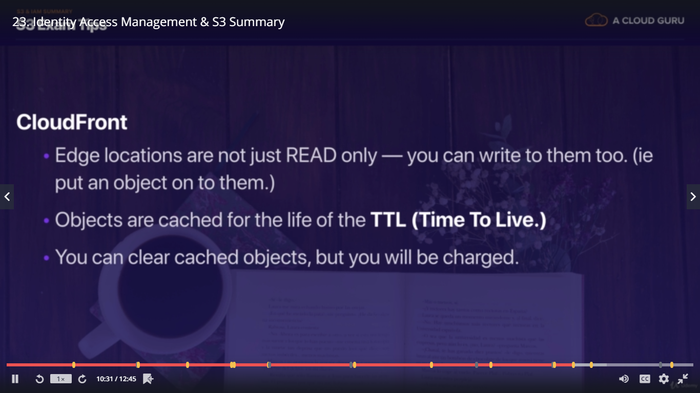

## section 3 - IAM & S3

* [section 3 - IAM FAQs](https://aws.amazon.com/iam/faqs/?nc=sn&loc=5)
* [section 3 - S3 FAQs](https://aws.amazon.com/s3/faqs/#)

#### FAQs

Q: Can IAM users have individual EC2 SSH keys?
Not in the initial release. IAM does not affect EC2 SSH keys or Windows RDP certificates. This means that although each user has separate credentials for accessing web service APIs, they must share SSH keys that are common across the AWS account under which users have been defined.

Q: Can I set usage quotas on IAM users?
No. All limits are on the AWS account as a whole. For example, if your AWS account has a limit of 20 Amazon EC2 instances, IAM users with EC2 permissions can start instances up to the limit. You cannot limit what an individual user can do.

Q: What is an IAM role?
An IAM role is an IAM entity that defines a set of permissions for making AWS service requests. IAM roles are not associated with a specific user or group. Instead, trusted entities assume roles, such as IAM users, applications, or AWS services such as EC2.

## IAM 101

  - IAM user sigin link : https://akhileshdumca.signin.aws.amazon.com/console, akhileshdumca is replaced    with 12-digit account id number.
  - Configure who uses AWS and their level of access to the AWS Console.
  - Centralized control over AWS Account.
  - Shared access to your AWS Account.
  - Granular permissions for users / services.
  - Identity Federation – Facebook, LinkedIn and Active Directory- You can login to AWS with your corporate credentials.
  - Multi-factor authentication – helps secure the account. Especially for root account.
  - Provide temporary access to users/devices and services.
  - Allows you to setup your own password rotation policy.
  - Integration with other AWS services.
  - Supports PCI-DSS compliance.

### Critical Terms

IAM consists of the following

  - Users – End users / people.
  - Groups – Users having one set of permissions.
  - Roles – Create roles and assign them to AWS resources.
  - Policies – Document (JSON format) that defines one or more permissions – assign to user or groups or roles.

### IAM Features

  - IAM is a global service. It is not region specific.
  - Root account is the email address you use to sign up for AWS.
  - AWS recommends very limited usage of root account.
  - Setup MFA on root account.
  - You can attach permissions to individual users and groups.
  - Secret access key can be retrieved only once during user creation. In case you lose it then you can re-generate it.
  - You can inactive the Access Key Id by clicking users -> security credentials -> Access Keys and then click the **Make inactive** button.
  - IAM Password policy can be set to access the admin console.
  - New users have no permissions when first created. Everything has to be explicitly added.
  - New users are assigned Access Key Id and Secret Access Key when first created. You can use these keys either with AWS API or command line or SDK. Though these things can't be used to login to console as a alternative to username/password.

  - *Power User Access allows Access to all AWS services except the management of groups and users within   IAM.

  - Group ARN ->  arn:aws:iam::47629277****:group/Administrators
  - Pattern ->    arn:aws:[service-name]::[12-digit-num]:group/[group-name]

  - Users ARN ->  arn:aws:iam::47629277****:user/Administrator
  - Pattern ->    arn:aws:[service-name]::[12-digit-num]:user/[user-name]

  - Role ARN ->   arn:aws:iam::47629277****:role/service-role/aws-lambda-role
  - Pattern ->    arn:aws:[service-name]::[12-digit-num]:role/service-role/[role-name]

  - Policy ARN -> arn:aws:iam::aws:policy/AdministratorAccess (AWS defined Policies.)
  - Pattern ->    arn:aws:[service-name]::aws:policy/[policy-name]

  - Policy ARN -> arn:aws:iam::47629277****:aws:policy/AdministratorAccess (User defined Policies.)
  - Pattern ->    arn:aws:[service-name]::[12-digit-num]:policy/[policy-name]

Manage AWS resources via

1. Management console – Using username and password.
2. Rest APIs – Using Access Key ID and Secret Access Key.
3. AWS CLI - Using Access Key ID and Secret Access Key.
4. AWS SDK – various programming languages supported.

Using Access Key ID and Secret Access Key – can be used only via accessing programmatically. Akin to username and password used while accessing the console

# AWS Object Storage & CDN – S3, Glacier and CloudFront
###### [Go to Index](#table-of-contents)

## S3 101 (Simple Storage Service)

  - S3 is object based storage i.e. it allows you to only save/store/upload files. You Can't run applications db,os and other s/w applications on this.
  - Files can be 0 to 5TB in size.
  - There is unlimited storage.
  - Files are stored in Buckets.
  - S3 is universal namespace, that is, names must be unique globally.
  - *S3 Bucket URL :-> https://s3.amazonaws.com/mylifecyclebucketak
  - *Pattern :-> https://s3.amazonaws.com/[bucketname]
  - *S3 Bucket URL :-> https://s3-eu-west-1.amazonaws.com/mylifecyclebucketak
  - *Pattern :-> https://s3-[region-name].amazonaws.com/[bucketname]
  - S3 File URL :-> https://s3.amazonaws.com/acloudguruwebsiteakhilesh/image1.PNG
  - Pattern :-> https://s3.amazonaws.com/[bucketname]/filename/[filename]
  - On successful completion of upload you'll get 200 status code.
  - You can upload files faster by enabling the multipart upload.

### S3 Data Consistency Model

  - Read after write consistency for PUTS of new Objects
  - Eventual consistency for overwrite PUTS and DELETES (can take some time to propagate). Though the retrieval is atomic i.e. no corrupted data, either the old one or the new one. It takes time at it'll put your data to multiple AZs for high scalability.

### S3 is a simple key value store

  - S3 is object based and consists of the following
    - Key(This is simply the name of the object).
      - S3 is designed to store the data lexographically(alphabatically) and same named files will be stored at the almost same location. So if your files are too heavy and are of the almost same name then you can have performance bottlenecks. To remedy this situtation you can add some randomness to the beginning of the file names. i.e. instead of test.log,test2.log,test3.log have 123test1.log,432test2.log.
    - Value(This is simply the data and made up of sequence of bytes).
    - Version ID(Important for versioning).
    - Metadata(Data about the data you are storing).
    - Subresources
      - Access Control List(fine grained permission setting)
      - Torrent(supports bittorrent protocol)

### S3 Basics

  - Tiered Storage Available
  - Lifecycle Management : Different type of storage options
  - Versioning
  - Encryption
  - Secure your data using ACL and Bucket Policies

### S3 Object Tier Storage Classes(SLA- Service Level Agreements regarding the durability and availability)

  - S3-Standard - Durability(Not loosing the file) of 99.999999999% and availability of 99.99%. Stored redundantly across multiple devices in multiple facilities and is designed to sustain the loss of 2 facilities concurrently. i.e. very very highly available.
  - S3 Standard-IA (Infrequently Accessed) - Durability of 99.999999999% and availability of 99.9%. For data that is accessed less frequently, but requires rapid access when needed. Lower fee than S3, but you are charged for retrieval. Minimum 30-day retention period and minimum 128 KB object size.
  - One Zone-IA - For infrequently accessed data. Stores data only in 1 AZ at a lower price than Standard-IA. Minimum 30-day retention period and minimum 128 KB object size.
  - S3-RRS (Reduced Redundancy Storage) - Durability and availability of 99.99%. Use when you don’t care if data is occasionally lost and can easily be re-created.
  
  - Glacier - For archival only. Takes 3 - 5 hours to restore files. Durability of 99.999999999%.

### S3 Charges

  - Storage(How much data you put exactly)
  - No. of Requests
  - Storage management pricing : Charged for per tag basis, developer intervention.
  - Data transfer pricing.(Incoming data is free but retrieving and tranferring is chargable)
  - Transfer Acceleration : It enables fast,easy and secure transfer using AWS cloudfront and it's global distributted edge locations.

### S3 Buckets

  - S3 Namespace is global also shows the same in AWS console. Buckets created in regions but Region independent i.e. buckets are managed globally.
  - A bucket name in any region should only contain lower case characters. It has to be DNS Compliant
  - By default all buckets are private.
  - Uploading multiple files at the same time will make it a single task so it'll show 1 Success/Error.
  - Object versioning - Different versions of the same object in a bucket.
  - Only Static website can be hosted. Auto scaling, Load Balancing etc. all managed automatically.
  - You can tag buckets (or any AWS resoruce) to track costs. Tags consist of keys and (optional) value pairs.
  - Lifecycle management of objects can be set. e.g. move to Glacier after 30 days.
  - Every bucket created, object uploaded is private by default.
  - Object Permissions – Access to Object ACLs.
  - Prefix in bucket is a folder in the bucket.
  - Minimum file size that I can store on S3 bucket is 0 byte.
  - Max 100 S3 buckets per account by default.
  - Individual Amazon S3 objects can range in size from a minimum of **0 bytes** to a maximum of **5 terabytes**. The largest object that can be uploaded in a single PUT is **5 gigabytes**. For objects larger than **100 megabytes**, customers should consider using the Multipart Upload capability.

### S3 Tagging

  - Tagging can be done on Bucket and Object level as well.
  - Object doesn't inherit the bucket tags.

### S3 Encryption

  - In transit
    - Using SSL/TLS
  - Data at rest
    - Client Side Encryption
      - Encrypt data at client side and then upload to S3.
    - Server side Encryption
      - Server side Encryption with Amazon S3 Managed Keys (SSE-S3 AES-256)
      - Server side Encryption with KMS (SSE-KMS)
      - Server side Encryption Customer Provided Keys (SSE-C). Key Management is responsibility of user.

### S3 Versioning

  - Once versioning is turned on it cannot be turned off. It can only be suspended. To remove versioning, you have to create a new bucket and transfer all files from old to new.
  - For newer version of an object, you still have to set permissions to allow access. It is disabled by default even if previous version is public.
  - All versions of the file add up to the storage. Hence for larger objects, ensure that there is some lifecycle versioning in place.
  - Version deleted cannot be restored.
  - Object deleted can be restored – Delete the Delete marker.
  - Versioning is a good backup tool.
  - For versioning. MFA can be setup for Delete capability for object / bucket – Complicated setup.

### S3 Cross Region Replication

  - To allow for cross region replication, the both source and target buckets must have versioning enabled.
  - Replication can be done within the same AWS account's bucket or to some other AWS account's bucket.
  - At the time of replication you can change the storage class of target bucket.
  - At the time of replication you can change the object ownership to destination bucket owner.
  - Replication can be done on the sub-directory as well.
  - For replication we'll be needing a IAM role. If we don't have one readily available then we can create one at the time of replication as well.
  - When cross region replication is enabled, all existing objects in the bucket are not copied over to replica site. Only subsequent Updates to existing objects and newer objects are replicated over. *All previous versions of the updated objects are replicated.*
  - To replicate the already existing objects you need to explicitly copy them from source bucket to target bucket using AWS-CLI or some other tool.
  - *Permissions are also replicated from one bucket to another.
  - Transitive replications do not work. E.g. if you setup bucket C to replicate content from bucket B which replicates content from bucket A – Changes made to bucket A will not get propagated to C. You will need to manually upload content to bucket B to trigger replication to C.
  - Delete markers are replicated.
  - If you delete source replication bucket objects, they are deleted from replica target bucket too. i.e. the delete marker is placed on source and target bucket objects. When you delete a Delete marker or version from source, that action is not replicated.

### S3 Lifecycle Management and Glacier

  - Lifecycle feature is used to manage the cost of the S3 service.
  - All changes works with object creation date.
  - Objects stored in Glacier incur minimum 90 day storage cost. so the time will be counted as the object palced in the Glacier not the object creation date.
  - Lifecycle management can be used in conjunction with versioning. If versioning is enabled then there will be lifecycle management for that as well.
  - Objects can be transitioned to S3-IA after 30 days and to Glacier class storage - 30 days IA.
  - You can also permanently delete objects which will delete the object from the Glacier as well.

### S3 Security

  - By default all newly created buckets are Private and the objects inside them are also private.
  - Control Access to buckets using
      - Bucket Policies – bucket wide.
      - Access Control Lists – up to individual objects.
  - S3 buckets can log all access requests to another S3 bucket even another AWS account.